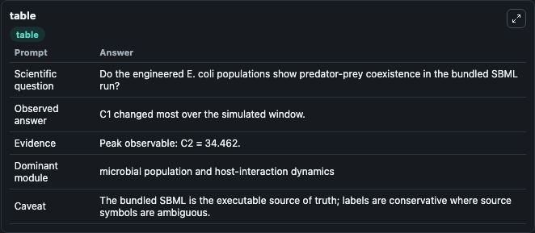
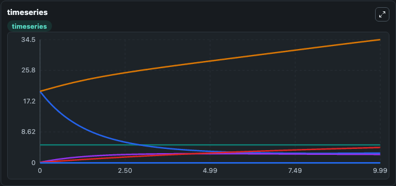
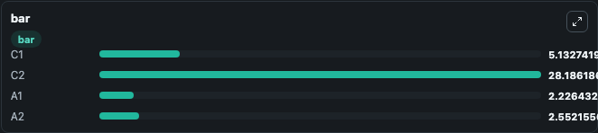

# Balagadde2008 E coli Predator Prey Lab

Curated microbiology lab for Balagadde2008_E_coli_Predator_Prey. The bundled SBML is executed directly through Tellurium and visualised with conservative, source-traceable labels.

This lab asks: **Do the engineered E. coli populations show predator-prey coexistence in the bundled SBML run?**

## Model Context

The core model executes the bundled sbml source through Biosimulant and publishes traceable state, summary, and observable ports. The visualisation model turns those ports into dark-mode run cards for quick inspection of microbiology dynamics.

Scope: microbial population and host-interaction dynamics.

Caveat: The bundled SBML is the executable source of truth; labels are conservative where source symbols are ambiguous.

## Run Context

- Duration: 10
- Communication step: 0.01
- Initial inputs: lab defaults

## Primary Inputs

- IPTG Inducer Level (IPTG)

## Primary Outputs

- Model state (state)
- Simulation summary (summary)
- Observable labels (species_labels)
- C1 (C1)
- C2 (C2)
- A1 (A1)
- A2 (A2)

## Model Wiring

- `balagadde2008_ecoli_predator_prey` uses `models/core`
- `visualisation` uses `models/visualisation`

- `balagadde2008_ecoli_predator_prey.state` -> `visualisation.balagadde2008_ecoli_predator_prey_state`
- `balagadde2008_ecoli_predator_prey.summary` -> `visualisation.balagadde2008_ecoli_predator_prey_summary`
- `balagadde2008_ecoli_predator_prey.species_labels` -> `visualisation.balagadde2008_ecoli_predator_prey_species_labels`
- `balagadde2008_ecoli_predator_prey.cell_population_1` -> `visualisation.balagadde2008_ecoli_predator_prey_cell_population_1`
- `balagadde2008_ecoli_predator_prey.cell_population_2` -> `visualisation.balagadde2008_ecoli_predator_prey_cell_population_2`
- `balagadde2008_ecoli_predator_prey.quorum_signal_1` -> `visualisation.balagadde2008_ecoli_predator_prey_quorum_signal_1`
- `balagadde2008_ecoli_predator_prey.quorum_signal_2` -> `visualisation.balagadde2008_ecoli_predator_prey_quorum_signal_2`

<!-- BIOSIMULANT_VISUALS_START -->
### Output Visualizations

#### visualisation table

The summary table records the numeric run outputs used to answer the lab question: Do the engineered E. coli populations show predator-prey coexistence in the bundled SBML run?

#### visualisation timeseries

The time-series view follows C1, C2, A1, A2 through the simulated run so the transient and final microbial dynamics are visible in one panel.

#### visualisation bar

The comparison view ranks the headline outputs from this run, making the dominant endpoint responses easy to scan.

<!-- BIOSIMULANT_VISUALS_END -->

## Source and Dependencies

- Core model: `models/core`
- Visualisation model: `models/visualisation`
- Upstream source: biomodels_ebi:BIOMD0000000296
- Upstream URL: https://www.ebi.ac.uk/biomodels/BIOMD0000000296
- License: CC0
- Runtime packages: tellurium==2.2.11.2

## Running in Biosimulant

Open this folder as a Biosimulant lab, then run the canvas. The screenshots above were captured from the served lab UI in dark mode using the automated README visualisation workflow.
