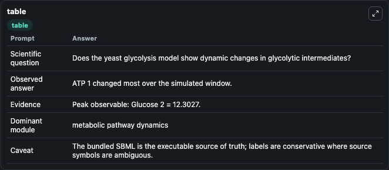
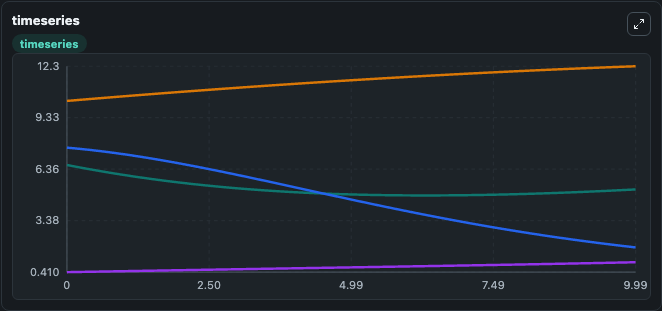
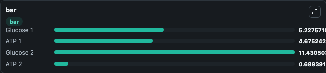

# Bier2000 GlycolyticOscillation Lab

Curated microbiology lab for Bier2000_GlycolyticOscillation. The bundled SBML is executed directly through Tellurium and visualised with conservative, source-traceable labels.

This lab asks: **Does the yeast glycolysis model show dynamic changes in glycolytic intermediates?**

## Model Context

The core model executes the bundled sbml source through Biosimulant and publishes traceable state, summary, and observable ports. The visualisation model turns those ports into dark-mode run cards for quick inspection of microbiology dynamics.

Scope: metabolic pathway dynamics.

Caveat: The bundled SBML is the executable source of truth; labels are conservative where source symbols are ambiguous.

## Run Context

- Duration: 10
- Communication step: 0.01
- Initial inputs: lab defaults

## Primary Inputs

- Initial Glucose Pool 1 (G1)
- Initial Glucose Pool 2 (G2)

## Primary Outputs

- Model state (state)
- Simulation summary (summary)
- Observable labels (species_labels)
- Glucose 1 (G1)
- ATP 1 (T1)
- Glucose 2 (G2)
- ATP 2 (T2)

## Model Wiring

- `bier2000_yeast_glycolytic_oscillation` uses `models/core`
- `visualisation` uses `models/visualisation`

- `bier2000_yeast_glycolytic_oscillation.state` -> `visualisation.bier2000_yeast_glycolytic_oscillation_state`
- `bier2000_yeast_glycolytic_oscillation.summary` -> `visualisation.bier2000_yeast_glycolytic_oscillation_summary`
- `bier2000_yeast_glycolytic_oscillation.species_labels` -> `visualisation.bier2000_yeast_glycolytic_oscillation_species_labels`
- `bier2000_yeast_glycolytic_oscillation.glucose_pool_1` -> `visualisation.bier2000_yeast_glycolytic_oscillation_glucose_pool_1`
- `bier2000_yeast_glycolytic_oscillation.atp_pool_1` -> `visualisation.bier2000_yeast_glycolytic_oscillation_atp_pool_1`
- `bier2000_yeast_glycolytic_oscillation.glucose_pool_2` -> `visualisation.bier2000_yeast_glycolytic_oscillation_glucose_pool_2`
- `bier2000_yeast_glycolytic_oscillation.atp_pool_2` -> `visualisation.bier2000_yeast_glycolytic_oscillation_atp_pool_2`

<!-- BIOSIMULANT_VISUALS_START -->
### Output Visualizations

#### visualisation table

The summary table records the numeric run outputs used to answer the lab question: Does the yeast glycolysis model show dynamic changes in glycolytic intermediates?

#### visualisation timeseries

The time-series view follows Glucose 1, ATP 1, Glucose 2, ATP 2 through the simulated run so the transient and final microbial dynamics are visible in one panel.

#### visualisation bar

The comparison view ranks the headline outputs from this run, making the dominant endpoint responses easy to scan.

<!-- BIOSIMULANT_VISUALS_END -->

## Source and Dependencies

- Core model: `models/core`
- Visualisation model: `models/visualisation`
- Upstream source: biomodels_ebi:BIOMD0000000254
- Upstream URL: https://www.ebi.ac.uk/biomodels/BIOMD0000000254
- License: CC0
- Runtime packages: tellurium==2.2.11.2

## Running in Biosimulant

Open this folder as a Biosimulant lab, then run the canvas. The screenshots above were captured from the served lab UI in dark mode using the automated README visualisation workflow.
