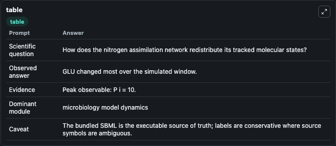
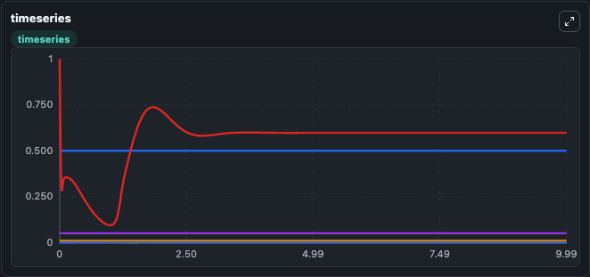
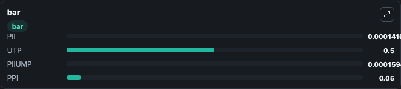

# Bruggeman2005 AmmoniumAssimilation Lab

Curated microbiology lab for Bruggeman2005_AmmoniumAssimilation. The bundled SBML is executed directly through Tellurium and visualised with conservative, source-traceable labels.

This lab asks: **How does the nitrogen assimilation network redistribute its tracked molecular states?**

## Model Context

The core model executes the bundled sbml source through Biosimulant and publishes traceable state, summary, and observable ports. The visualisation model turns those ports into dark-mode run cards for quick inspection of microbiology dynamics.

Scope: microbiology model dynamics.

Caveat: The bundled SBML is the executable source of truth; labels are conservative where source symbols are ambiguous.

## Run Context

- Duration: 10
- Communication step: 0.01
- Initial inputs: lab defaults

## Primary Inputs

- External Ammonium (NH4)
- Alpha Ketoglutarate Pool (KG)

## Primary Outputs

- Model state (state)
- Simulation summary (summary)
- Observable labels (species_labels)
- PII (PII)
- UTP (UTP)
- PIIUMP (PIIUMP)
- PPi (PPi)

## Model Wiring

- `bruggeman2005_ammonium_assimilation` uses `models/core`
- `visualisation` uses `models/visualisation`

- `bruggeman2005_ammonium_assimilation.state` -> `visualisation.bruggeman2005_ammonium_assimilation_state`
- `bruggeman2005_ammonium_assimilation.summary` -> `visualisation.bruggeman2005_ammonium_assimilation_summary`
- `bruggeman2005_ammonium_assimilation.species_labels` -> `visualisation.bruggeman2005_ammonium_assimilation_species_labels`
- `bruggeman2005_ammonium_assimilation.pii_regulatory_protein` -> `visualisation.bruggeman2005_ammonium_assimilation_pii_regulatory_protein`
- `bruggeman2005_ammonium_assimilation.uridine_triphosphate` -> `visualisation.bruggeman2005_ammonium_assimilation_uridine_triphosphate`
- `bruggeman2005_ammonium_assimilation.uridylylated_pii_protein` -> `visualisation.bruggeman2005_ammonium_assimilation_uridylylated_pii_protein`
- `bruggeman2005_ammonium_assimilation.inorganic_pyrophosphate` -> `visualisation.bruggeman2005_ammonium_assimilation_inorganic_pyrophosphate`

<!-- BIOSIMULANT_VISUALS_START -->
### Output Visualizations

#### visualisation table

The summary table records the numeric run outputs used to answer the lab question: How does the nitrogen assimilation network redistribute its tracked molecular states?

#### visualisation timeseries

The time-series view follows PII, UTP, PIIUMP, PPi through the simulated run so the transient and final microbial dynamics are visible in one panel.

#### visualisation bar

The comparison view ranks the headline outputs from this run, making the dominant endpoint responses easy to scan.

<!-- BIOSIMULANT_VISUALS_END -->

## Source and Dependencies

- Core model: `models/core`
- Visualisation model: `models/visualisation`
- Upstream source: biomodels_ebi:BIOMD0000000217
- Upstream URL: https://www.ebi.ac.uk/biomodels/BIOMD0000000217
- License: CC0
- Runtime packages: tellurium==2.2.11.2

## Running in Biosimulant

Open this folder as a Biosimulant lab, then run the canvas. The screenshots above were captured from the served lab UI in dark mode using the automated README visualisation workflow.
