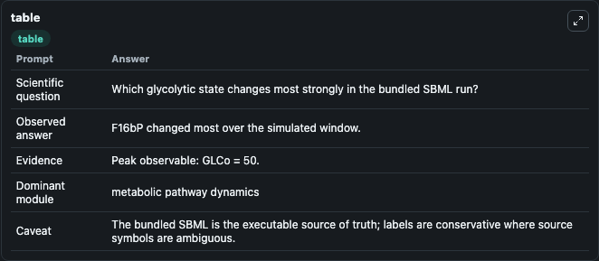
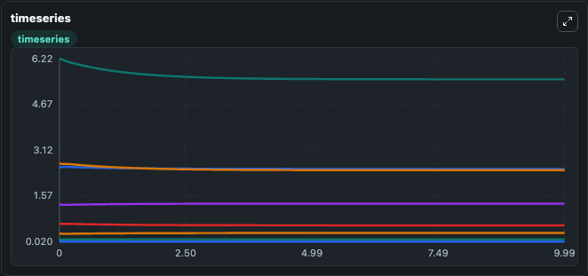

# Conant2007 WGD glycolysis 2A3AB Lab

Curated microbiology lab for Conant2007_WGD_glycolysis_2A3AB. The bundled SBML is executed directly through Tellurium and visualised with conservative, source-traceable labels.

This lab asks: **Which glycolytic state changes most strongly in the bundled SBML run?**

## Model Context

The core model executes the bundled sbml source through Biosimulant and publishes traceable state, summary, and observable ports. The visualisation model turns those ports into dark-mode run cards for quick inspection of microbiology dynamics.

Scope: metabolic pathway dynamics.

Caveat: The bundled SBML is the executable source of truth; labels are conservative where source symbols are ambiguous.

## Run Context

- Duration: 10
- Communication step: 0.01
- Initial inputs: lab defaults

## Primary Inputs

- External Glucose (GLCo)
- Fructose 26 Bisphosphate Pool (F26bP)

## Primary Outputs

- Model state (state)
- Simulation summary (summary)
- Observable labels (species_labels)
- GLCi (GLCi)
- ATP (ATP)
- G6P (G6P)
- ADP (ADP)

## Model Wiring

- `conant2007_wgd_glycolysis_2a3ab` uses `models/core`
- `visualisation` uses `models/visualisation`

- `conant2007_wgd_glycolysis_2a3ab.state` -> `visualisation.conant2007_wgd_glycolysis_2a3ab_state`
- `conant2007_wgd_glycolysis_2a3ab.summary` -> `visualisation.conant2007_wgd_glycolysis_2a3ab_summary`
- `conant2007_wgd_glycolysis_2a3ab.species_labels` -> `visualisation.conant2007_wgd_glycolysis_2a3ab_species_labels`
- `conant2007_wgd_glycolysis_2a3ab.intracellular_glucose` -> `visualisation.conant2007_wgd_glycolysis_2a3ab_intracellular_glucose`
- `conant2007_wgd_glycolysis_2a3ab.atp` -> `visualisation.conant2007_wgd_glycolysis_2a3ab_atp`
- `conant2007_wgd_glycolysis_2a3ab.glucose_6_phosphate` -> `visualisation.conant2007_wgd_glycolysis_2a3ab_glucose_6_phosphate`
- `conant2007_wgd_glycolysis_2a3ab.adp` -> `visualisation.conant2007_wgd_glycolysis_2a3ab_adp`

<!-- BIOSIMULANT_VISUALS_START -->
### Output Visualizations

#### visualisation table

The summary table records the numeric run outputs used to answer the lab question: Which glycolytic state changes most strongly in the bundled SBML run?

#### visualisation timeseries

The time-series view follows GLCi, ATP, G6P, ADP through the simulated run so the transient and final microbial dynamics are visible in one panel.

#### visualisation bar

The comparison view ranks the headline outputs from this run, making the dominant endpoint responses easy to scan.

<!-- BIOSIMULANT_VISUALS_END -->

## Source and Dependencies

- Core model: `models/core`
- Visualisation model: `models/visualisation`
- Upstream source: biomodels_ebi:BIOMD0000000176
- Upstream URL: https://www.ebi.ac.uk/biomodels/BIOMD0000000176
- License: CC0
- Runtime packages: tellurium==2.2.11.2

## Running in Biosimulant

Open this folder as a Biosimulant lab, then run the canvas. The screenshots above were captured from the served lab UI in dark mode using the automated README visualisation workflow.
