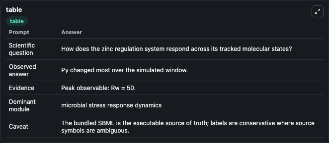
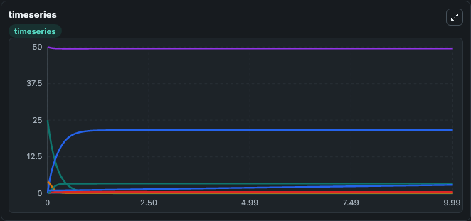
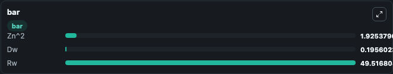

# Cui2008 - in vitro transcriptional response of zinc homeostasis system in Escherichia coli Lab

Curated microbiology lab for Cui2008 - in vitro transcriptional response of zinc homeostasis system in Escherichia coli. The bundled SBML is executed directly through Tellurium and visualised with conservative, source-traceable labels.

This lab asks: **How does the zinc regulation system respond across its tracked molecular states?**

## Model Context

The core model executes the bundled sbml source through Biosimulant and publishes traceable state, summary, and observable ports. The visualisation model turns those ports into dark-mode run cards for quick inspection of microbiology dynamics.

Scope: microbial stress response dynamics.

Caveat: The bundled SBML is the executable source of truth; labels are conservative where source symbols are ambiguous.

## Run Context

- Duration: 10
- Communication step: 0.01
- Initial inputs: lab defaults

## Primary Inputs

- Zinc Concentration (Zn)

## Primary Outputs

- Model state (state)
- Simulation summary (summary)
- Observable labels (species_labels)
- Zn^2 (Zn_2)
- Dw (Dw)
- Rw (Rw)

## Model Wiring

- `cui2008_ecoli_zinc_transcription` uses `models/core`
- `visualisation` uses `models/visualisation`

- `cui2008_ecoli_zinc_transcription.state` -> `visualisation.cui2008_ecoli_zinc_transcription_state`
- `cui2008_ecoli_zinc_transcription.summary` -> `visualisation.cui2008_ecoli_zinc_transcription_summary`
- `cui2008_ecoli_zinc_transcription.species_labels` -> `visualisation.cui2008_ecoli_zinc_transcription_species_labels`
- `cui2008_ecoli_zinc_transcription.zinc_complex` -> `visualisation.cui2008_ecoli_zinc_transcription_zinc_complex`
- `cui2008_ecoli_zinc_transcription.zinc_promoter_state` -> `visualisation.cui2008_ecoli_zinc_transcription_zinc_promoter_state`
- `cui2008_ecoli_zinc_transcription.zinc_transcript_state` -> `visualisation.cui2008_ecoli_zinc_transcription_zinc_transcript_state`

<!-- BIOSIMULANT_VISUALS_START -->
### Output Visualizations

#### visualisation table

The summary table records the numeric run outputs used to answer the lab question: How does the zinc regulation system respond across its tracked molecular states?

#### visualisation timeseries

The time-series view follows Zn^2, Dw, Rw through the simulated run so the transient and final microbial dynamics are visible in one panel.

#### visualisation bar

The comparison view ranks the headline outputs from this run, making the dominant endpoint responses easy to scan.

<!-- BIOSIMULANT_VISUALS_END -->

## Source and Dependencies

- Core model: `models/core`
- Visualisation model: `models/visualisation`
- Upstream source: biomodels_ebi:BIOMD0000000966
- Upstream URL: https://www.ebi.ac.uk/biomodels/BIOMD0000000966
- License: CC0
- Runtime packages: tellurium==2.2.11.2

## Running in Biosimulant

Open this folder as a Biosimulant lab, then run the canvas. The screenshots above were captured from the served lab UI in dark mode using the automated README visualisation workflow.
