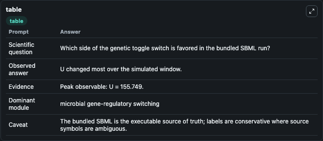
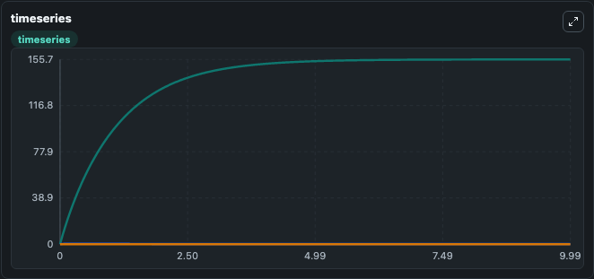
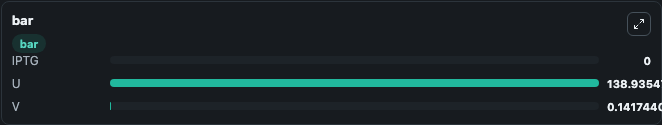

# Gardner2000 - genetic toggle switch in E.coli Lab

Curated microbiology lab for Gardner2000 - genetic toggle switch in E.coli. The bundled SBML is executed directly through Tellurium and visualised with conservative, source-traceable labels.

This lab asks: **Which side of the genetic toggle switch is favored in the bundled SBML run?**

## Model Context

The core model executes the bundled sbml source through Biosimulant and publishes traceable state, summary, and observable ports. The visualisation model turns those ports into dark-mode run cards for quick inspection of microbiology dynamics.

Scope: microbial gene-regulatory switching.

Caveat: The bundled SBML is the executable source of truth; labels are conservative where source symbols are ambiguous.

## Run Context

- Duration: 10
- Communication step: 0.01
- Initial inputs: lab defaults

## Primary Inputs

- IPTG Inducer Level (species_3)

## Primary Outputs

- Model state (state)
- Simulation summary (summary)
- Observable labels (species_labels)
- IPTG (species_3)
- U (species_1)
- V (species_2)

## Model Wiring

- `gardner2000_ecoli_toggle_switch` uses `models/core`
- `visualisation` uses `models/visualisation`

- `gardner2000_ecoli_toggle_switch.state` -> `visualisation.gardner2000_ecoli_toggle_switch_state`
- `gardner2000_ecoli_toggle_switch.summary` -> `visualisation.gardner2000_ecoli_toggle_switch_summary`
- `gardner2000_ecoli_toggle_switch.species_labels` -> `visualisation.gardner2000_ecoli_toggle_switch_species_labels`
- `gardner2000_ecoli_toggle_switch.iptg_inducer` -> `visualisation.gardner2000_ecoli_toggle_switch_iptg_inducer`
- `gardner2000_ecoli_toggle_switch.first_toggle_repressor` -> `visualisation.gardner2000_ecoli_toggle_switch_first_toggle_repressor`
- `gardner2000_ecoli_toggle_switch.second_toggle_repressor` -> `visualisation.gardner2000_ecoli_toggle_switch_second_toggle_repressor`

<!-- BIOSIMULANT_VISUALS_START -->
### Output Visualizations

#### visualisation table

The summary table records the numeric run outputs used to answer the lab question: Which side of the genetic toggle switch is favored in the bundled SBML run?

#### visualisation timeseries

The time-series view follows IPTG, U, V through the simulated run so the transient and final microbial dynamics are visible in one panel.

#### visualisation bar

The comparison view ranks the headline outputs from this run, making the dominant endpoint responses easy to scan.

<!-- BIOSIMULANT_VISUALS_END -->

## Source and Dependencies

- Core model: `models/core`
- Visualisation model: `models/visualisation`
- Upstream source: biomodels_ebi:BIOMD0000000507
- Upstream URL: https://www.ebi.ac.uk/biomodels/BIOMD0000000507
- License: CC0
- Runtime packages: tellurium==2.2.11.2

## Running in Biosimulant

Open this folder as a Biosimulant lab, then run the canvas. The screenshots above were captured from the served lab UI in dark mode using the automated README visualisation workflow.
