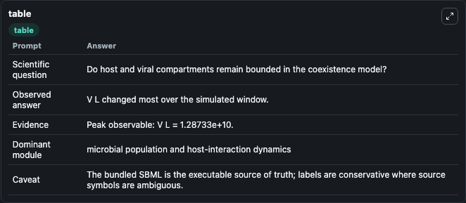
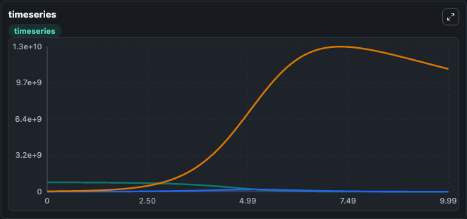
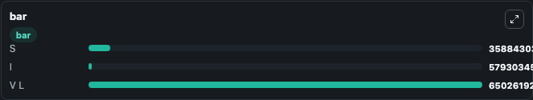

# Gulbudak2019.1 - Heterogeneous viral strategies promote coexistence in virus-microbe systems (Lytic) Lab

Curated microbiology lab for Gulbudak2019.1 - Heterogeneous viral strategies promote coexistence in virus-microbe systems (Lytic). The bundled SBML is executed directly through Tellurium and visualised with conservative, source-traceable labels.

This lab asks: **Do host and viral compartments remain bounded in the coexistence model?**

## Model Context

The core model executes the bundled sbml source through Biosimulant and publishes traceable state, summary, and observable ports. The visualisation model turns those ports into dark-mode run cards for quick inspection of microbiology dynamics.

Scope: microbial population and host-interaction dynamics.

Caveat: The bundled SBML is the executable source of truth; labels are conservative where source symbols are ambiguous.

## Run Context

- Duration: 10
- Communication step: 0.01
- Initial inputs: lab defaults

## Primary Inputs

- Infection Rate (beta)

## Primary Outputs

- Model state (state)
- Simulation summary (summary)
- Observable labels (species_labels)
- S (S)
- I (I)
- V L (V_L)

## Model Wiring

- `gulbudak2019_viral_strategy_l` uses `models/core`
- `visualisation` uses `models/visualisation`

- `gulbudak2019_viral_strategy_l.state` -> `visualisation.gulbudak2019_viral_strategy_l_state`
- `gulbudak2019_viral_strategy_l.summary` -> `visualisation.gulbudak2019_viral_strategy_l_summary`
- `gulbudak2019_viral_strategy_l.species_labels` -> `visualisation.gulbudak2019_viral_strategy_l_species_labels`
- `gulbudak2019_viral_strategy_l.susceptible_hosts` -> `visualisation.gulbudak2019_viral_strategy_l_susceptible_hosts`
- `gulbudak2019_viral_strategy_l.infected_hosts` -> `visualisation.gulbudak2019_viral_strategy_l_infected_hosts`
- `gulbudak2019_viral_strategy_l.free_lytic_virus` -> `visualisation.gulbudak2019_viral_strategy_l_free_lytic_virus`

<!-- BIOSIMULANT_VISUALS_START -->
### Output Visualizations

#### visualisation table

The summary table records the numeric run outputs used to answer the lab question: Do host and viral compartments remain bounded in the coexistence model?

#### visualisation timeseries

The time-series view follows S, I, V L through the simulated run so the transient and final microbial dynamics are visible in one panel.

#### visualisation bar

The comparison view ranks the headline outputs from this run, making the dominant endpoint responses easy to scan.

<!-- BIOSIMULANT_VISUALS_END -->

## Source and Dependencies

- Core model: `models/core`
- Visualisation model: `models/visualisation`
- Upstream source: biomodels_ebi:BIOMD0000000845
- Upstream URL: https://www.ebi.ac.uk/biomodels/BIOMD0000000845
- License: CC0
- Runtime packages: tellurium==2.2.11.2

## Running in Biosimulant

Open this folder as a Biosimulant lab, then run the canvas. The screenshots above were captured from the served lab UI in dark mode using the automated README visualisation workflow.
