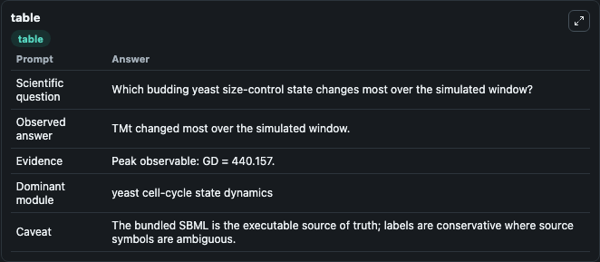
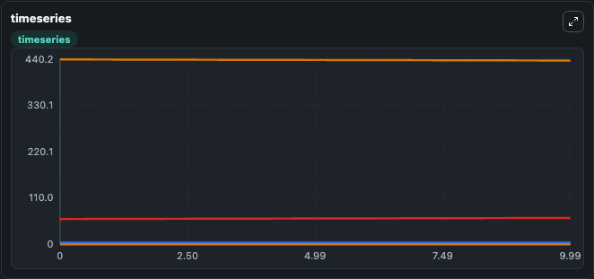
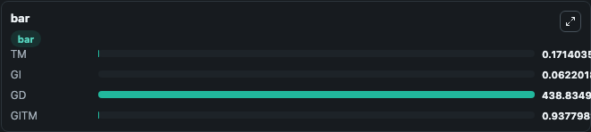

# Heldt2018 - Budding yeast size control by titration of nuclear sites Lab

Curated microbiology lab for Heldt2018 - Budding yeast size control by titration of nuclear sites. The bundled SBML is executed directly through Tellurium and visualised with conservative, source-traceable labels.

This lab asks: **Which budding yeast size-control state changes most over the simulated window?**

## Model Context

The core model executes the bundled sbml source through Biosimulant and publishes traceable state, summary, and observable ports. The visualisation model turns those ports into dark-mode run cards for quick inspection of microbiology dynamics.

Scope: yeast cell-cycle state dynamics.

Caveat: The bundled SBML is the executable source of truth; labels are conservative where source symbols are ambiguous.

## Run Context

- Duration: 10
- Communication step: 0.01
- Initial inputs: lab defaults

## Primary Inputs

- Total Cln3 (CLN3t)
- Total Whi5 (WHIt)

## Primary Outputs

- Model state (state)
- Simulation summary (summary)
- Observable labels (species_labels)
- TM (TM)
- GI (GI)
- GD (GD)
- GITM (GITM)

## Model Wiring

- `heldt2018_budding_yeast_size_control` uses `models/core`
- `visualisation` uses `models/visualisation`

- `heldt2018_budding_yeast_size_control.state` -> `visualisation.heldt2018_budding_yeast_size_control_state`
- `heldt2018_budding_yeast_size_control.summary` -> `visualisation.heldt2018_budding_yeast_size_control_summary`
- `heldt2018_budding_yeast_size_control.species_labels` -> `visualisation.heldt2018_budding_yeast_size_control_species_labels`
- `heldt2018_budding_yeast_size_control.titration_module_state` -> `visualisation.heldt2018_budding_yeast_size_control_titration_module_state`
- `heldt2018_budding_yeast_size_control.growth_initiation_state` -> `visualisation.heldt2018_budding_yeast_size_control_growth_initiation_state`
- `heldt2018_budding_yeast_size_control.growth_division_state` -> `visualisation.heldt2018_budding_yeast_size_control_growth_division_state`
- `heldt2018_budding_yeast_size_control.growth_initiation_titration_complex` -> `visualisation.heldt2018_budding_yeast_size_control_growth_initiation_titration_complex`

<!-- BIOSIMULANT_VISUALS_START -->
### Output Visualizations

#### visualisation table

The summary table records the numeric run outputs used to answer the lab question: Which budding yeast size-control state changes most over the simulated window?

#### visualisation timeseries

The time-series view follows TM, GI, GD, GITM through the simulated run so the transient and final microbial dynamics are visible in one panel.

#### visualisation bar

The comparison view ranks the headline outputs from this run, making the dominant endpoint responses easy to scan.

<!-- BIOSIMULANT_VISUALS_END -->

## Source and Dependencies

- Core model: `models/core`
- Visualisation model: `models/visualisation`
- Upstream source: biomodels_ebi:MODEL1803220002
- Upstream URL: https://www.ebi.ac.uk/biomodels/MODEL1803220002
- License: CC0
- Runtime packages: tellurium==2.2.11.2

## Running in Biosimulant

Open this folder as a Biosimulant lab, then run the canvas. The screenshots above were captured from the served lab UI in dark mode using the automated README visualisation workflow.
