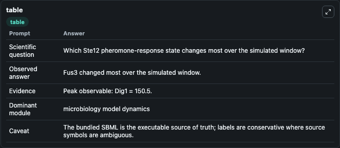
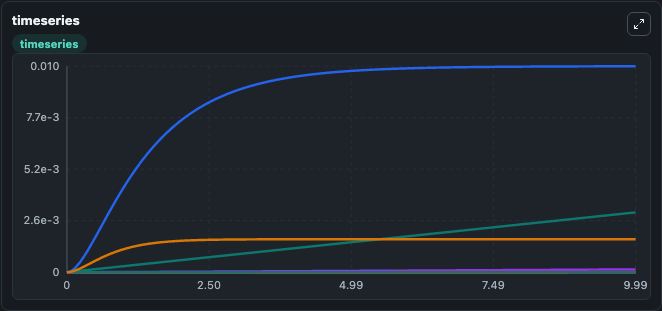
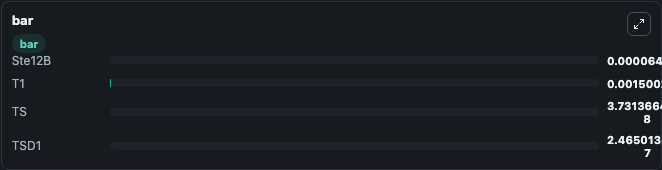

# Houser2012 pheromone Ste12 Lab

Curated microbiology lab for Houser2012_pheromone_Ste12. The bundled SBML is executed directly through Tellurium and visualised with conservative, source-traceable labels.

This lab asks: **Which Ste12 pheromone-response state changes most over the simulated window?**

## Model Context

The core model executes the bundled sbml source through Biosimulant and publishes traceable state, summary, and observable ports. The visualisation model turns those ports into dark-mode run cards for quick inspection of microbiology dynamics.

Scope: microbiology model dynamics.

Caveat: The bundled SBML is the executable source of truth; labels are conservative where source symbols are ambiguous.

## Run Context

- Duration: 10
- Communication step: 0.01
- Initial inputs: lab defaults

## Primary Inputs

- Pheromone Input Signal (I)
- Initial Dig1 Level (Dig1)

## Primary Outputs

- Model state (state)
- Simulation summary (summary)
- Observable labels (species_labels)
- Ste12B (Ste12B)
- T1 (T1)
- TS (TS)
- TSD1 (TSD1)

## Model Wiring

- `houser2012_yeast_pheromone_ste12` uses `models/core`
- `visualisation` uses `models/visualisation`

- `houser2012_yeast_pheromone_ste12.state` -> `visualisation.houser2012_yeast_pheromone_ste12_state`
- `houser2012_yeast_pheromone_ste12.summary` -> `visualisation.houser2012_yeast_pheromone_ste12_summary`
- `houser2012_yeast_pheromone_ste12.species_labels` -> `visualisation.houser2012_yeast_pheromone_ste12_species_labels`
- `houser2012_yeast_pheromone_ste12.bound_ste12_transcription_factor` -> `visualisation.houser2012_yeast_pheromone_ste12_bound_ste12_transcription_factor`
- `houser2012_yeast_pheromone_ste12.pheromone_state_one` -> `visualisation.houser2012_yeast_pheromone_ste12_pheromone_state_one`
- `houser2012_yeast_pheromone_ste12.pheromone_ste12_complex` -> `visualisation.houser2012_yeast_pheromone_ste12_pheromone_ste12_complex`
- `houser2012_yeast_pheromone_ste12.pheromone_ste12_dig1_complex` -> `visualisation.houser2012_yeast_pheromone_ste12_pheromone_ste12_dig1_complex`

<!-- BIOSIMULANT_VISUALS_START -->
### Output Visualizations

#### visualisation table

The summary table records the numeric run outputs used to answer the lab question: Which Ste12 pheromone-response state changes most over the simulated window?

#### visualisation timeseries

The time-series view follows Ste12B, T1, TS, TSD1 through the simulated run so the transient and final microbial dynamics are visible in one panel.

#### visualisation bar

The comparison view ranks the headline outputs from this run, making the dominant endpoint responses easy to scan.

<!-- BIOSIMULANT_VISUALS_END -->

## Source and Dependencies

- Core model: `models/core`
- Visualisation model: `models/visualisation`
- Upstream source: biomodels_ebi:MODEL1204040000
- Upstream URL: https://www.ebi.ac.uk/biomodels/MODEL1204040000
- License: CC0
- Runtime packages: tellurium==2.2.11.2

## Running in Biosimulant

Open this folder as a Biosimulant lab, then run the canvas. The screenshots above were captured from the served lab UI in dark mode using the automated README visualisation workflow.
