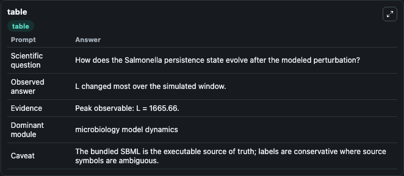
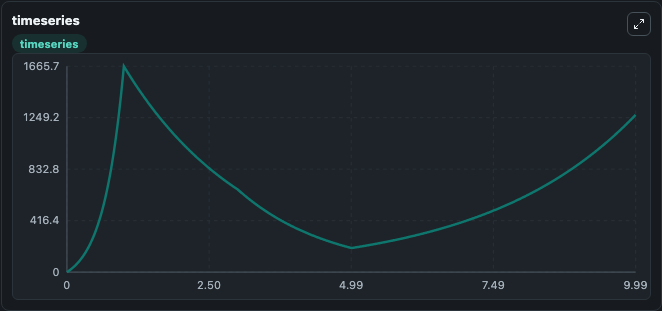
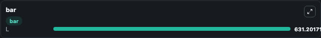

# Kaiser2014 - Salmonella persistence after ciprofloxacin treatment Lab

Curated microbiology lab for Kaiser2014 - Salmonella persistence after ciprofloxacin treatment. The bundled SBML is executed directly through Tellurium and visualised with conservative, source-traceable labels.

This lab asks: **How does the Salmonella persistence state evolve after the modeled perturbation?**

## Model Context

The core model executes the bundled sbml source through Biosimulant and publishes traceable state, summary, and observable ports. The visualisation model turns those ports into dark-mode run cards for quick inspection of microbiology dynamics.

Scope: microbiology model dynamics.

Caveat: The bundled SBML is the executable source of truth; labels are conservative where source symbols are ambiguous.

## Run Context

- Duration: 10
- Communication step: 0.01
- Initial inputs: lab defaults

## Primary Inputs

- Initial Persistent Salmonella Load (L)

## Primary Outputs

- Model state (state)
- Simulation summary (summary)
- Observable labels (species_labels)
- L (L)

## Model Wiring

- `kaiser2014_salmonella_persistence` uses `models/core`
- `visualisation` uses `models/visualisation`

- `kaiser2014_salmonella_persistence.state` -> `visualisation.kaiser2014_salmonella_persistence_state`
- `kaiser2014_salmonella_persistence.summary` -> `visualisation.kaiser2014_salmonella_persistence_summary`
- `kaiser2014_salmonella_persistence.species_labels` -> `visualisation.kaiser2014_salmonella_persistence_species_labels`
- `kaiser2014_salmonella_persistence.persistent_salmonella_load` -> `visualisation.kaiser2014_salmonella_persistence_persistent_salmonella_load`

<!-- BIOSIMULANT_VISUALS_START -->
### Output Visualizations

#### visualisation table

The summary table records the numeric run outputs used to answer the lab question: How does the Salmonella persistence state evolve after the modeled perturbation?

#### visualisation timeseries

The time-series view follows L through the simulated run so the transient and final microbial dynamics are visible in one panel.

#### visualisation bar

The comparison view ranks the headline outputs from this run, making the dominant endpoint responses easy to scan.

<!-- BIOSIMULANT_VISUALS_END -->

## Source and Dependencies

- Core model: `models/core`
- Visualisation model: `models/visualisation`
- Upstream source: biomodels_ebi:BIOMD0000000527
- Upstream URL: https://www.ebi.ac.uk/biomodels/BIOMD0000000527
- License: CC0
- Runtime packages: tellurium==2.2.11.2

## Running in Biosimulant

Open this folder as a Biosimulant lab, then run the canvas. The screenshots above were captured from the served lab UI in dark mode using the automated README visualisation workflow.
