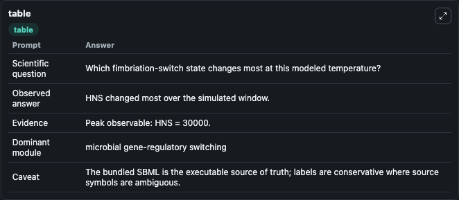
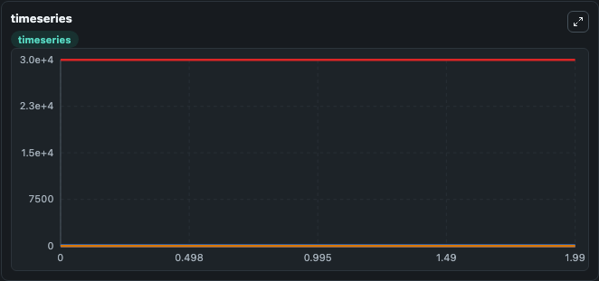
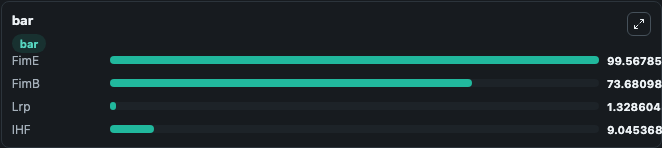

# Kuwahara2010 Fimbriation Switch 28C Lab

Curated microbiology lab for Kuwahara2010_Fimbriation_Switch_28C. The bundled SBML is executed directly through Tellurium and visualised with conservative, source-traceable labels.

This lab asks: **Which fimbriation-switch state changes most at this modeled temperature?**

## Model Context

The core model executes the bundled sbml source through Biosimulant and publishes traceable state, summary, and observable ports. The visualisation model turns those ports into dark-mode run cards for quick inspection of microbiology dynamics.

Scope: microbial gene-regulatory switching.

Caveat: The bundled SBML is the executable source of truth; labels are conservative where source symbols are ambiguous.

## Run Context

- Duration: 2
- Communication step: 0.01
- Initial inputs: lab defaults

## Primary Inputs

- Initial FimE Site Recombinase (FimE)
- Initial FimB Site Recombinase (FimB)

## Primary Outputs

- Model state (state)
- Simulation summary (summary)
- Observable labels (species_labels)
- FimE (FimE)
- FimB (FimB)
- Lrp (Lrp)
- IHF (IHF)

## Model Wiring

- `kuwahara2010_fimbriation_switch_28c` uses `models/core`
- `visualisation` uses `models/visualisation`

- `kuwahara2010_fimbriation_switch_28c.state` -> `visualisation.kuwahara2010_fimbriation_switch_28c_state`
- `kuwahara2010_fimbriation_switch_28c.summary` -> `visualisation.kuwahara2010_fimbriation_switch_28c_summary`
- `kuwahara2010_fimbriation_switch_28c.species_labels` -> `visualisation.kuwahara2010_fimbriation_switch_28c_species_labels`
- `kuwahara2010_fimbriation_switch_28c.fime_site_recombinase` -> `visualisation.kuwahara2010_fimbriation_switch_28c_fime_site_recombinase`
- `kuwahara2010_fimbriation_switch_28c.fimb_site_recombinase` -> `visualisation.kuwahara2010_fimbriation_switch_28c_fimb_site_recombinase`
- `kuwahara2010_fimbriation_switch_28c.leucine_responsive_regulatory_protein` -> `visualisation.kuwahara2010_fimbriation_switch_28c_leucine_responsive_regulatory_protein`
- `kuwahara2010_fimbriation_switch_28c.integration_host_factor` -> `visualisation.kuwahara2010_fimbriation_switch_28c_integration_host_factor`

<!-- BIOSIMULANT_VISUALS_START -->
### Output Visualizations

#### visualisation table

The summary table records the numeric run outputs used to answer the lab question: Which fimbriation-switch state changes most at this modeled temperature?

#### visualisation timeseries

The time-series view follows FimE, FimB, Lrp, IHF through the simulated run so the transient and final microbial dynamics are visible in one panel.

#### visualisation bar

The comparison view ranks the headline outputs from this run, making the dominant endpoint responses easy to scan.

<!-- BIOSIMULANT_VISUALS_END -->

## Source and Dependencies

- Core model: `models/core`
- Visualisation model: `models/visualisation`
- Upstream source: biomodels_ebi:MODEL1004010000
- Upstream URL: https://www.ebi.ac.uk/biomodels/MODEL1004010000
- License: CC0
- Runtime packages: tellurium==2.2.11.2

## Running in Biosimulant

Open this folder as a Biosimulant lab, then run the canvas. The screenshots above were captured from the served lab UI in dark mode using the automated README visualisation workflow.
