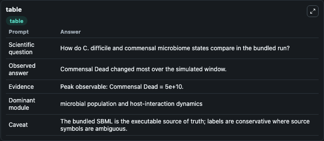
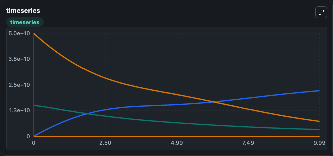
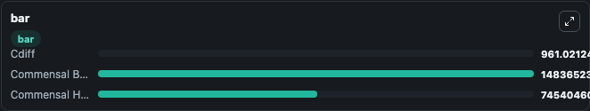

# Leber2015 - Mucosal immunity and gut microbiome interaction during C. difficile infection Lab

Curated microbiology lab for Leber2015 - Mucosal immunity and gut microbiome interaction during C. difficile infection. The bundled SBML is executed directly through Tellurium and visualised with conservative, source-traceable labels.

This lab asks: **How do C. difficile and commensal microbiome states compare in the bundled run?**

## Model Context

The core model executes the bundled sbml source through Biosimulant and publishes traceable state, summary, and observable ports. The visualisation model turns those ports into dark-mode run cards for quick inspection of microbiology dynamics.

Scope: microbial population and host-interaction dynamics.

Caveat: The bundled SBML is the executable source of truth; labels are conservative where source symbols are ambiguous.

## Run Context

- Duration: 10
- Communication step: 0.01
- Initial inputs: lab defaults

## Primary Inputs

- Initial Clostridioides Difficile (Cdiff)
- Initial Beneficial Commensals (Commensal_Beneficial)

## Primary Outputs

- Model state (state)
- Simulation summary (summary)
- Observable labels (species_labels)
- Cdiff (Cdiff)
- Commensal Beneficial (Commensal_Beneficial)
- Commensal Harmful (Commensal_Harmful)

## Model Wiring

- `leber2015_cdiff_gut_microbiome` uses `models/core`
- `visualisation` uses `models/visualisation`

- `leber2015_cdiff_gut_microbiome.state` -> `visualisation.leber2015_cdiff_gut_microbiome_state`
- `leber2015_cdiff_gut_microbiome.summary` -> `visualisation.leber2015_cdiff_gut_microbiome_summary`
- `leber2015_cdiff_gut_microbiome.species_labels` -> `visualisation.leber2015_cdiff_gut_microbiome_species_labels`
- `leber2015_cdiff_gut_microbiome.clostridioides_difficile` -> `visualisation.leber2015_cdiff_gut_microbiome_clostridioides_difficile`
- `leber2015_cdiff_gut_microbiome.beneficial_commensals` -> `visualisation.leber2015_cdiff_gut_microbiome_beneficial_commensals`
- `leber2015_cdiff_gut_microbiome.harmful_commensals` -> `visualisation.leber2015_cdiff_gut_microbiome_harmful_commensals`

<!-- BIOSIMULANT_VISUALS_START -->
### Output Visualizations

#### visualisation table

The summary table records the numeric run outputs used to answer the lab question: How do C. difficile and commensal microbiome states compare in the bundled run?

#### visualisation timeseries

The time-series view follows Cdiff, Commensal Beneficial, Commensal Harmful through the simulated run so the transient and final microbial dynamics are visible in one panel.

#### visualisation bar

The comparison view ranks the headline outputs from this run, making the dominant endpoint responses easy to scan.

<!-- BIOSIMULANT_VISUALS_END -->

## Source and Dependencies

- Core model: `models/core`
- Visualisation model: `models/visualisation`
- Upstream source: biomodels_ebi:BIOMD0000000583
- Upstream URL: https://www.ebi.ac.uk/biomodels/BIOMD0000000583
- License: CC0
- Runtime packages: tellurium==2.2.11.2

## Running in Biosimulant

Open this folder as a Biosimulant lab, then run the canvas. The screenshots above were captured from the served lab UI in dark mode using the automated README visualisation workflow.
