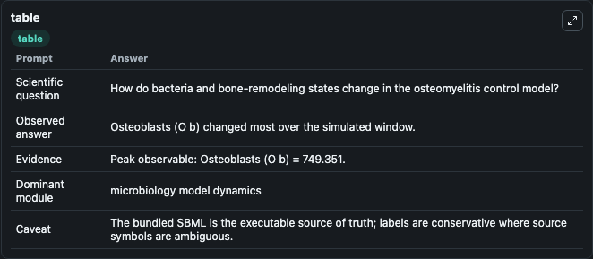
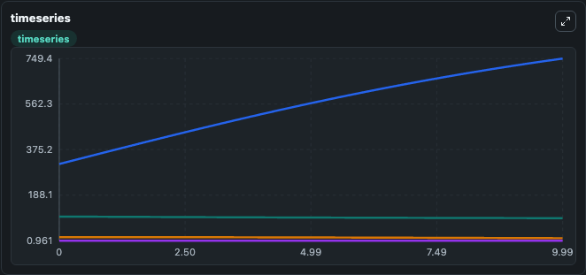
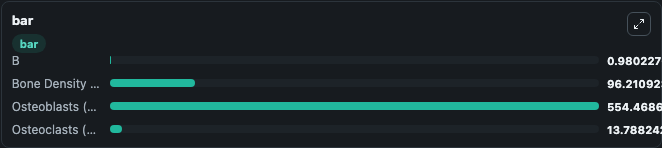

# Lio2012 Modelling osteomyelitis Control Model Lab

Curated microbiology lab for Lio2012_Modelling osteomyelitis_Control Model. The bundled SBML is executed directly through Tellurium and visualised with conservative, source-traceable labels.

This lab asks: **How do bacteria and bone-remodeling states change in the osteomyelitis control model?**

## Model Context

The core model executes the bundled sbml source through Biosimulant and publishes traceable state, summary, and observable ports. The visualisation model turns those ports into dark-mode run cards for quick inspection of microbiology dynamics.

Scope: microbiology model dynamics.

Caveat: The bundled SBML is the executable source of truth; labels are conservative where source symbols are ambiguous.

## Run Context

- Duration: 10
- Communication step: 0.01
- Initial inputs: lab defaults

## Primary Inputs

- Treatment Start Time (t_treat)
- Initial Bacterial Burden (B)

## Primary Outputs

- Model state (state)
- Simulation summary (summary)
- Observable labels (species_labels)
- B (B)
- Bone Density (z) (Bone_Density__z)
- Osteoblasts (O b) (Osteoblasts__O_b)
- Osteoclasts (O c) (Osteoclasts__O_c)

## Model Wiring

- `lio2012_osteomyelitis_control` uses `models/core`
- `visualisation` uses `models/visualisation`

- `lio2012_osteomyelitis_control.state` -> `visualisation.lio2012_osteomyelitis_control_state`
- `lio2012_osteomyelitis_control.summary` -> `visualisation.lio2012_osteomyelitis_control_summary`
- `lio2012_osteomyelitis_control.species_labels` -> `visualisation.lio2012_osteomyelitis_control_species_labels`
- `lio2012_osteomyelitis_control.bacterial_burden` -> `visualisation.lio2012_osteomyelitis_control_bacterial_burden`
- `lio2012_osteomyelitis_control.bone_density` -> `visualisation.lio2012_osteomyelitis_control_bone_density`
- `lio2012_osteomyelitis_control.osteoblasts` -> `visualisation.lio2012_osteomyelitis_control_osteoblasts`
- `lio2012_osteomyelitis_control.osteoclasts` -> `visualisation.lio2012_osteomyelitis_control_osteoclasts`

<!-- BIOSIMULANT_VISUALS_START -->
### Output Visualizations

#### visualisation table

The summary table records the numeric run outputs used to answer the lab question: How do bacteria and bone-remodeling states change in the osteomyelitis control model?

#### visualisation timeseries

The time-series view follows B, Bone Density (z), Osteoblasts (O b), Osteoclasts (O c) through the simulated run so the transient and final microbial dynamics are visible in one panel.

#### visualisation bar

The comparison view ranks the headline outputs from this run, making the dominant endpoint responses easy to scan.

<!-- BIOSIMULANT_VISUALS_END -->

## Source and Dependencies

- Core model: `models/core`
- Visualisation model: `models/visualisation`
- Upstream source: biomodels_ebi:BIOMD0000000923
- Upstream URL: https://www.ebi.ac.uk/biomodels/BIOMD0000000923
- License: CC0
- Runtime packages: tellurium==2.2.11.2

## Running in Biosimulant

Open this folder as a Biosimulant lab, then run the canvas. The screenshots above were captured from the served lab UI in dark mode using the automated README visualisation workflow.
