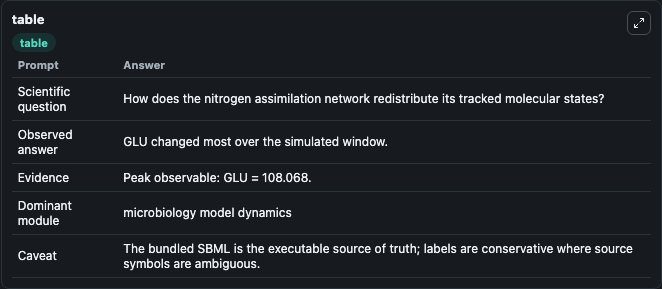
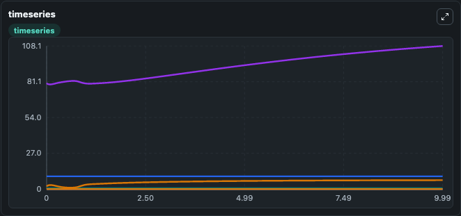
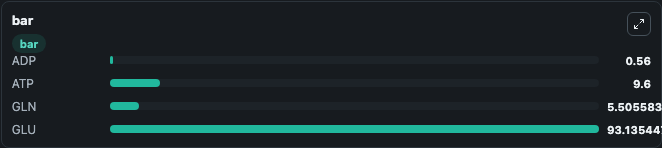

# Maeda2019 AmmoniumTransportAssimilation Lab

Curated microbiology lab for Maeda2019_AmmoniumTransportAssimilation. The bundled SBML is executed directly through Tellurium and visualised with conservative, source-traceable labels.

This lab asks: **How does the nitrogen assimilation network redistribute its tracked molecular states?**

## Model Context

The core model executes the bundled sbml source through Biosimulant and publishes traceable state, summary, and observable ports. The visualisation model turns those ports into dark-mode run cards for quick inspection of microbiology dynamics.

Scope: microbiology model dynamics.

Caveat: The bundled SBML is the executable source of truth; labels are conservative where source symbols are ambiguous.

## Run Context

- Duration: 10
- Communication step: 0.01
- Initial inputs: lab defaults

## Primary Inputs

- External Ammonium (NH4ext)
- External pH (pHext)

## Primary Outputs

- Model state (state)
- Simulation summary (summary)
- Observable labels (species_labels)
- ADP (ADP)
- ATP (ATP)
- GLN (GLN)
- GLU (GLU)

## Model Wiring

- `maeda2019_ammonium_transport_assimilation` uses `models/core`
- `visualisation` uses `models/visualisation`

- `maeda2019_ammonium_transport_assimilation.state` -> `visualisation.maeda2019_ammonium_transport_assimilation_state`
- `maeda2019_ammonium_transport_assimilation.summary` -> `visualisation.maeda2019_ammonium_transport_assimilation_summary`
- `maeda2019_ammonium_transport_assimilation.species_labels` -> `visualisation.maeda2019_ammonium_transport_assimilation_species_labels`
- `maeda2019_ammonium_transport_assimilation.adp` -> `visualisation.maeda2019_ammonium_transport_assimilation_adp`
- `maeda2019_ammonium_transport_assimilation.atp` -> `visualisation.maeda2019_ammonium_transport_assimilation_atp`
- `maeda2019_ammonium_transport_assimilation.glutamine` -> `visualisation.maeda2019_ammonium_transport_assimilation_glutamine`
- `maeda2019_ammonium_transport_assimilation.glutamate` -> `visualisation.maeda2019_ammonium_transport_assimilation_glutamate`

<!-- BIOSIMULANT_VISUALS_START -->
### Output Visualizations

#### visualisation table

The summary table records the numeric run outputs used to answer the lab question: How does the nitrogen assimilation network redistribute its tracked molecular states?

#### visualisation timeseries

The time-series view follows ADP, ATP, GLN, GLU through the simulated run so the transient and final microbial dynamics are visible in one panel.

#### visualisation bar

The comparison view ranks the headline outputs from this run, making the dominant endpoint responses easy to scan.

<!-- BIOSIMULANT_VISUALS_END -->

## Source and Dependencies

- Core model: `models/core`
- Visualisation model: `models/visualisation`
- Upstream source: biomodels_ebi:MODEL1901090001
- Upstream URL: https://www.ebi.ac.uk/biomodels/MODEL1901090001
- License: CC0
- Runtime packages: tellurium==2.2.11.2

## Running in Biosimulant

Open this folder as a Biosimulant lab, then run the canvas. The screenshots above were captured from the served lab UI in dark mode using the automated README visualisation workflow.
