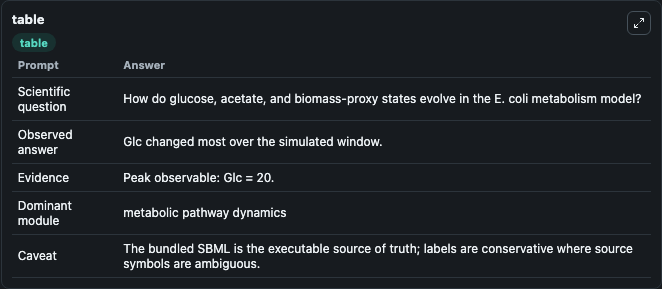
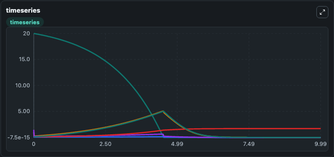
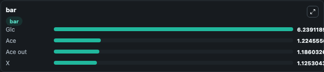

# Millard2020 - Kinetic model of Glucose and Acetate metabolisms in E. coli Lab

Curated microbiology lab for Millard2020 - Kinetic model of Glucose and Acetate metabolisms in E. coli. The bundled SBML is executed directly through Tellurium and visualised with conservative, source-traceable labels.

This lab asks: **How do glucose, acetate, and biomass-proxy states evolve in the E. coli metabolism model?**

## Model Context

The core model executes the bundled sbml source through Biosimulant and publishes traceable state, summary, and observable ports. The visualisation model turns those ports into dark-mode run cards for quick inspection of microbiology dynamics.

Scope: metabolic pathway dynamics.

Caveat: The bundled SBML is the executable source of truth; labels are conservative where source symbols are ambiguous.

## Run Context

- Duration: 10
- Communication step: 0.01
- Initial inputs: lab defaults

## Primary Inputs

- External Glucose (Glc)
- Extracellular Acetate Level (Ace_out)
- Dilution Rate (_dilution_rate)
- Feed Rate (_feed)

## Primary Outputs

- Model state (state)
- Simulation summary (summary)
- Observable labels (species_labels)
- Glc (Glc)
- Ace (Ace)
- Ace out (Ace_out)
- X (X)

## Model Wiring

- `millard2020_ecoli_glucose_acetate` uses `models/core`
- `visualisation` uses `models/visualisation`

- `millard2020_ecoli_glucose_acetate.state` -> `visualisation.millard2020_ecoli_glucose_acetate_state`
- `millard2020_ecoli_glucose_acetate.summary` -> `visualisation.millard2020_ecoli_glucose_acetate_summary`
- `millard2020_ecoli_glucose_acetate.species_labels` -> `visualisation.millard2020_ecoli_glucose_acetate_species_labels`
- `millard2020_ecoli_glucose_acetate.glucose` -> `visualisation.millard2020_ecoli_glucose_acetate_glucose`
- `millard2020_ecoli_glucose_acetate.acetate` -> `visualisation.millard2020_ecoli_glucose_acetate_acetate`
- `millard2020_ecoli_glucose_acetate.extracellular_acetate` -> `visualisation.millard2020_ecoli_glucose_acetate_extracellular_acetate`
- `millard2020_ecoli_glucose_acetate.input_regulator` -> `visualisation.millard2020_ecoli_glucose_acetate_input_regulator`

<!-- BIOSIMULANT_VISUALS_START -->
### Output Visualizations

#### visualisation table

The summary table records the numeric run outputs used to answer the lab question: How do glucose, acetate, and biomass-proxy states evolve in the E. coli metabolism model?

#### visualisation timeseries

The time-series view follows Glc, Ace, Ace out, X through the simulated run so the transient and final microbial dynamics are visible in one panel.

#### visualisation bar

The comparison view ranks the headline outputs from this run, making the dominant endpoint responses easy to scan.

<!-- BIOSIMULANT_VISUALS_END -->

## Source and Dependencies

- Core model: `models/core`
- Visualisation model: `models/visualisation`
- Upstream source: biomodels_ebi:MODEL2005050001
- Upstream URL: https://www.ebi.ac.uk/biomodels/MODEL2005050001
- License: CC0
- Runtime packages: tellurium==2.2.11.2

## Running in Biosimulant

Open this folder as a Biosimulant lab, then run the canvas. The screenshots above were captured from the served lab UI in dark mode using the automated README visualisation workflow.
