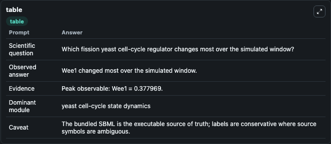
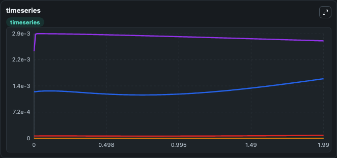
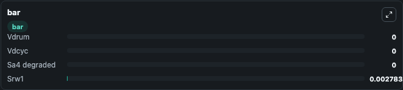

# Moriya2011 CellCycle FissionYeast Lab

Curated microbiology lab for Moriya2011_CellCycle_FissionYeast. The bundled SBML is executed directly through Tellurium and visualised with conservative, source-traceable labels.

This lab asks: **Which fission yeast cell-cycle regulator changes most over the simulated window?**

## Model Context

The core model executes the bundled sbml source through Biosimulant and publishes traceable state, summary, and observable ports. The visualisation model turns those ports into dark-mode run cards for quick inspection of microbiology dynamics.

Scope: yeast cell-cycle state dynamics.

Caveat: The bundled SBML is the executable source of truth; labels are conservative where source symbols are ambiguous.

## Run Context

- Duration: 2
- Communication step: 0.01
- Initial inputs: lab defaults

## Primary Inputs

- Drum Cycle Velocity Control (s4)
- Cell Cycle Velocity Control (s9)

## Primary Outputs

- Model state (state)
- Simulation summary (summary)
- Observable labels (species_labels)
- Vdrum (s4)
- Vdcyc (s9)
- Sa4 degraded (s46)
- Srw1 (s47)

## Model Wiring

- `moriya2011_fission_yeast_cell_cycle` uses `models/core`
- `visualisation` uses `models/visualisation`

- `moriya2011_fission_yeast_cell_cycle.state` -> `visualisation.moriya2011_fission_yeast_cell_cycle_state`
- `moriya2011_fission_yeast_cell_cycle.summary` -> `visualisation.moriya2011_fission_yeast_cell_cycle_summary`
- `moriya2011_fission_yeast_cell_cycle.species_labels` -> `visualisation.moriya2011_fission_yeast_cell_cycle_species_labels`
- `moriya2011_fission_yeast_cell_cycle.drum_cycle_velocity_state` -> `visualisation.moriya2011_fission_yeast_cell_cycle_drum_cycle_velocity_state`
- `moriya2011_fission_yeast_cell_cycle.cell_cycle_velocity_state` -> `visualisation.moriya2011_fission_yeast_cell_cycle_cell_cycle_velocity_state`
- `moriya2011_fission_yeast_cell_cycle.degraded_sa4_state` -> `visualisation.moriya2011_fission_yeast_cell_cycle_degraded_sa4_state`
- `moriya2011_fission_yeast_cell_cycle.srw1_regulator` -> `visualisation.moriya2011_fission_yeast_cell_cycle_srw1_regulator`

<!-- BIOSIMULANT_VISUALS_START -->
### Output Visualizations

#### visualisation table

The summary table records the numeric run outputs used to answer the lab question: Which fission yeast cell-cycle regulator changes most over the simulated window?

#### visualisation timeseries

The time-series view follows Vdrum, Vdcyc, Sa4 degraded, Srw1 through the simulated run so the transient and final microbial dynamics are visible in one panel.

#### visualisation bar

The comparison view ranks the headline outputs from this run, making the dominant endpoint responses easy to scan.

<!-- BIOSIMULANT_VISUALS_END -->

## Source and Dependencies

- Core model: `models/core`
- Visualisation model: `models/visualisation`
- Upstream source: biomodels_ebi:BIOMD0000000406
- Upstream URL: https://www.ebi.ac.uk/biomodels/BIOMD0000000406
- License: CC0
- Runtime packages: tellurium==2.2.11.2

## Running in Biosimulant

Open this folder as a Biosimulant lab, then run the canvas. The screenshots above were captured from the served lab UI in dark mode using the automated README visualisation workflow.
