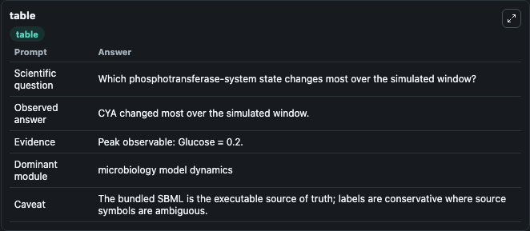
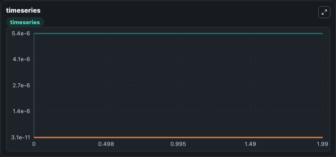
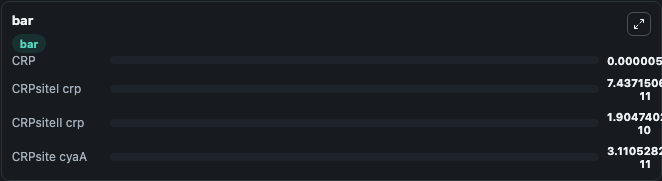

# Nishio2008 - Design of the phosphotransferase system for enhanced glucose uptake in E. coli. Lab

Curated microbiology lab for Nishio2008 - Design of the phosphotransferase system for enhanced glucose uptake in E. coli.. The bundled SBML is executed directly through Tellurium and visualised with conservative, source-traceable labels.

This lab asks: **Which phosphotransferase-system state changes most over the simulated window?**

## Model Context

The core model executes the bundled sbml source through Biosimulant and publishes traceable state, summary, and observable ports. The visualisation model turns those ports into dark-mode run cards for quick inspection of microbiology dynamics.

Scope: microbiology model dynamics.

Caveat: The bundled SBML is the executable source of truth; labels are conservative where source symbols are ambiguous.

## Run Context

- Duration: 2
- Communication step: 0.01
- Initial inputs: lab defaults

## Primary Inputs

- Glucose Concentration (Glucose)

## Primary Outputs

- Model state (state)
- Simulation summary (summary)
- Observable labels (species_labels)
- CRP (CRP)
- CRPsiteI crp (CRPsiteI_crp)
- CRPsiteII crp (CRPsiteII_crp)
- CRPsite cyaA (CRPsite_cyaA)

## Model Wiring

- `nishio2008_ecoli_phosphotransferase_system` uses `models/core`
- `visualisation` uses `models/visualisation`

- `nishio2008_ecoli_phosphotransferase_system.state` -> `visualisation.nishio2008_ecoli_phosphotransferase_system_state`
- `nishio2008_ecoli_phosphotransferase_system.summary` -> `visualisation.nishio2008_ecoli_phosphotransferase_system_summary`
- `nishio2008_ecoli_phosphotransferase_system.species_labels` -> `visualisation.nishio2008_ecoli_phosphotransferase_system_species_labels`
- `nishio2008_ecoli_phosphotransferase_system.camp_receptor_protein` -> `visualisation.nishio2008_ecoli_phosphotransferase_system_camp_receptor_protein`
- `nishio2008_ecoli_phosphotransferase_system.camp_receptor_protein_bound_site_one` -> `visualisation.nishio2008_ecoli_phosphotransferase_system_camp_receptor_protein_bound_site_one`
- `nishio2008_ecoli_phosphotransferase_system.camp_receptor_protein_bound_site_two` -> `visualisation.nishio2008_ecoli_phosphotransferase_system_camp_receptor_protein_bound_site_two`
- `nishio2008_ecoli_phosphotransferase_system.camp_receptor_protein_bound_cyaa_site` -> `visualisation.nishio2008_ecoli_phosphotransferase_system_camp_receptor_protein_bound_cyaa_site`

<!-- BIOSIMULANT_VISUALS_START -->
### Output Visualizations

#### visualisation table

The summary table records the numeric run outputs used to answer the lab question: Which phosphotransferase-system state changes most over the simulated window?

#### visualisation timeseries

The time-series view follows CRP, CRPsiteI crp, CRPsiteII crp, CRPsite cyaA through the simulated run so the transient and final microbial dynamics are visible in one panel.

#### visualisation bar

The comparison view ranks the headline outputs from this run, making the dominant endpoint responses easy to scan.

<!-- BIOSIMULANT_VISUALS_END -->

## Source and Dependencies

- Core model: `models/core`
- Visualisation model: `models/visualisation`
- Upstream source: biomodels_ebi:BIOMD0000000571
- Upstream URL: https://www.ebi.ac.uk/biomodels/BIOMD0000000571
- License: CC0
- Runtime packages: tellurium==2.2.11.2

## Running in Biosimulant

Open this folder as a Biosimulant lab, then run the canvas. The screenshots above were captured from the served lab UI in dark mode using the automated README visualisation workflow.
