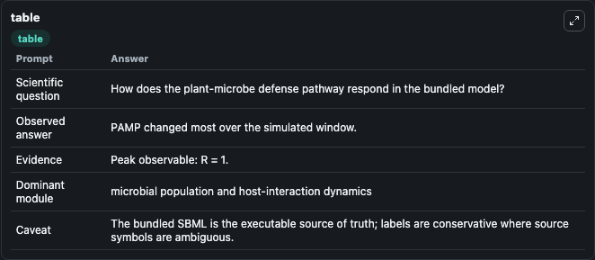
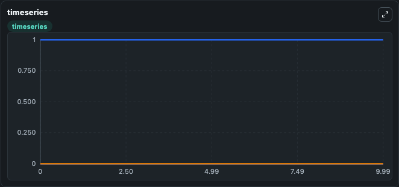
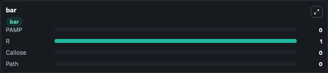

# Pritchard2014 - plant-microbe interaction Lab

Curated microbiology lab for Pritchard2014 - plant-microbe interaction. The bundled SBML is executed directly through Tellurium and visualised with conservative, source-traceable labels.

This lab asks: **How does the plant-microbe defense pathway respond in the bundled model?**

## Model Context

The core model executes the bundled sbml source through Biosimulant and publishes traceable state, summary, and observable ports. The visualisation model turns those ports into dark-mode run cards for quick inspection of microbiology dynamics.

Scope: microbial population and host-interaction dynamics.

Caveat: The bundled SBML is the executable source of truth; labels are conservative where source symbols are ambiguous.

## Run Context

- Duration: 10
- Communication step: 0.01
- Initial inputs: lab defaults

## Primary Inputs

- Initial PAMP Signal (PAMP)
- Initial Pathogen Load (Path)

## Primary Outputs

- Model state (state)
- Simulation summary (summary)
- Observable labels (species_labels)
- PAMP (PAMP)
- R (R)
- Callose (Callose)
- Path (Path)

## Model Wiring

- `pritchard2014_plant_microbe_interaction` uses `models/core`
- `visualisation` uses `models/visualisation`

- `pritchard2014_plant_microbe_interaction.state` -> `visualisation.pritchard2014_plant_microbe_interaction_state`
- `pritchard2014_plant_microbe_interaction.summary` -> `visualisation.pritchard2014_plant_microbe_interaction_summary`
- `pritchard2014_plant_microbe_interaction.species_labels` -> `visualisation.pritchard2014_plant_microbe_interaction_species_labels`
- `pritchard2014_plant_microbe_interaction.pamp_signal` -> `visualisation.pritchard2014_plant_microbe_interaction_pamp_signal`
- `pritchard2014_plant_microbe_interaction.receptor_state` -> `visualisation.pritchard2014_plant_microbe_interaction_receptor_state`
- `pritchard2014_plant_microbe_interaction.callose` -> `visualisation.pritchard2014_plant_microbe_interaction_callose`
- `pritchard2014_plant_microbe_interaction.pathogen_load` -> `visualisation.pritchard2014_plant_microbe_interaction_pathogen_load`

<!-- BIOSIMULANT_VISUALS_START -->
### Output Visualizations

#### visualisation table

The summary table records the numeric run outputs used to answer the lab question: How does the plant-microbe defense pathway respond in the bundled model?

#### visualisation timeseries

The time-series view follows PAMP, R, Callose, Path through the simulated run so the transient and final microbial dynamics are visible in one panel.

#### visualisation bar

The comparison view ranks the headline outputs from this run, making the dominant endpoint responses easy to scan.

<!-- BIOSIMULANT_VISUALS_END -->

## Source and Dependencies

- Core model: `models/core`
- Visualisation model: `models/visualisation`
- Upstream source: biomodels_ebi:BIOMD0000000563
- Upstream URL: https://www.ebi.ac.uk/biomodels/BIOMD0000000563
- License: CC0
- Runtime packages: tellurium==2.2.11.2

## Running in Biosimulant

Open this folder as a Biosimulant lab, then run the canvas. The screenshots above were captured from the served lab UI in dark mode using the automated README visualisation workflow.
