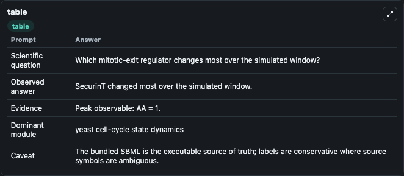
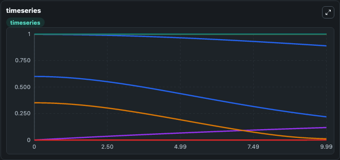
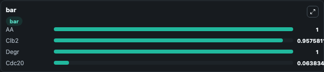

# Queralt2006 MitoticExit Cdc55DownregulationBySeparase Lab

Curated microbiology lab for Queralt2006_MitoticExit_Cdc55DownregulationBySeparase. The bundled SBML is executed directly through Tellurium and visualised with conservative, source-traceable labels.

This lab asks: **Which mitotic-exit regulator changes most over the simulated window?**

## Model Context

The core model executes the bundled sbml source through Biosimulant and publishes traceable state, summary, and observable ports. The visualisation model turns those ports into dark-mode run cards for quick inspection of microbiology dynamics.

Scope: yeast cell-cycle state dynamics.

Caveat: The bundled SBML is the executable source of truth; labels are conservative where source symbols are ambiguous.

## Run Context

- Duration: 10
- Communication step: 0.01
- Initial inputs: lab defaults

## Primary Inputs

- Amino Acid Pool Level (AA)
- Degradation Signal Level (degr)

## Primary Outputs

- Model state (state)
- Simulation summary (summary)
- Observable labels (species_labels)
- AA (AA)
- Clb2 (Clb2)
- Degr (degr)
- Cdc20 (Cdc20)

## Model Wiring

- `queralt2006_cdc55_separase_mitotic_exit` uses `models/core`
- `visualisation` uses `models/visualisation`

- `queralt2006_cdc55_separase_mitotic_exit.state` -> `visualisation.queralt2006_cdc55_separase_mitotic_exit_state`
- `queralt2006_cdc55_separase_mitotic_exit.summary` -> `visualisation.queralt2006_cdc55_separase_mitotic_exit_summary`
- `queralt2006_cdc55_separase_mitotic_exit.species_labels` -> `visualisation.queralt2006_cdc55_separase_mitotic_exit_species_labels`
- `queralt2006_cdc55_separase_mitotic_exit.amino_acid_pool` -> `visualisation.queralt2006_cdc55_separase_mitotic_exit_amino_acid_pool`
- `queralt2006_cdc55_separase_mitotic_exit.clb2_cyclin_level` -> `visualisation.queralt2006_cdc55_separase_mitotic_exit_clb2_cyclin_level`
- `queralt2006_cdc55_separase_mitotic_exit.degradation_signal` -> `visualisation.queralt2006_cdc55_separase_mitotic_exit_degradation_signal`
- `queralt2006_cdc55_separase_mitotic_exit.cdc20_level` -> `visualisation.queralt2006_cdc55_separase_mitotic_exit_cdc20_level`

<!-- BIOSIMULANT_VISUALS_START -->
### Output Visualizations

#### visualisation table

The summary table records the numeric run outputs used to answer the lab question: Which mitotic-exit regulator changes most over the simulated window?

#### visualisation timeseries

The time-series view follows AA, Clb2, Degr, Cdc20 through the simulated run so the transient and final microbial dynamics are visible in one panel.

#### visualisation bar

The comparison view ranks the headline outputs from this run, making the dominant endpoint responses easy to scan.

<!-- BIOSIMULANT_VISUALS_END -->

## Source and Dependencies

- Core model: `models/core`
- Visualisation model: `models/visualisation`
- Upstream source: biomodels_ebi:BIOMD0000000409
- Upstream URL: https://www.ebi.ac.uk/biomodels/BIOMD0000000409
- License: CC0
- Runtime packages: tellurium==2.2.11.2

## Running in Biosimulant

Open this folder as a Biosimulant lab, then run the canvas. The screenshots above were captured from the served lab UI in dark mode using the automated README visualisation workflow.
