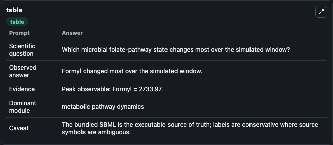
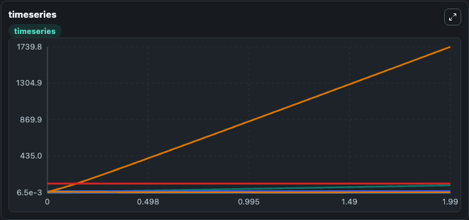
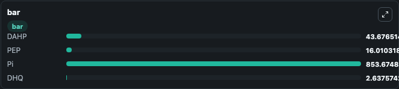

# Salcedo-Sora2016 - Microbial folate biosynthesis and utilisation Lab

Curated microbiology lab for Salcedo-Sora2016 - Microbial folate biosynthesis and utilisation. The bundled SBML is executed directly through Tellurium and visualised with conservative, source-traceable labels.

This lab asks: **Which microbial folate-pathway state changes most over the simulated window?**

## Model Context

The core model executes the bundled sbml source through Biosimulant and publishes traceable state, summary, and observable ports. The visualisation model turns those ports into dark-mode run cards for quick inspection of microbiology dynamics.

Scope: metabolic pathway dynamics.

Caveat: The bundled SBML is the executable source of truth; labels are conservative where source symbols are ambiguous.

## Run Context

- Duration: 2
- Communication step: 0.01
- Initial inputs: lab defaults

## Primary Inputs

- Phosphoenolpyruvate Pool (PEP)
- Glutamine Pool (Gln)

## Primary Outputs

- Model state (state)
- Simulation summary (summary)
- Observable labels (species_labels)
- DAHP (DAHP)
- PEP (PEP)
- Pi (Pi)
- DHQ (DHQ)

## Model Wiring

- `salcedosora2016_microbial_folate_biosynthesis` uses `models/core`
- `visualisation` uses `models/visualisation`

- `salcedosora2016_microbial_folate_biosynthesis.state` -> `visualisation.salcedosora2016_microbial_folate_biosynthesis_state`
- `salcedosora2016_microbial_folate_biosynthesis.summary` -> `visualisation.salcedosora2016_microbial_folate_biosynthesis_summary`
- `salcedosora2016_microbial_folate_biosynthesis.species_labels` -> `visualisation.salcedosora2016_microbial_folate_biosynthesis_species_labels`
- `salcedosora2016_microbial_folate_biosynthesis.deoxy_arabino_heptulosonate_phosphate` -> `visualisation.salcedosora2016_microbial_folate_biosynthesis_deoxy_arabino_heptulosonate_phosphate`
- `salcedosora2016_microbial_folate_biosynthesis.phosphoenolpyruvate` -> `visualisation.salcedosora2016_microbial_folate_biosynthesis_phosphoenolpyruvate`
- `salcedosora2016_microbial_folate_biosynthesis.phosphate` -> `visualisation.salcedosora2016_microbial_folate_biosynthesis_phosphate`
- `salcedosora2016_microbial_folate_biosynthesis.dehydroquinate` -> `visualisation.salcedosora2016_microbial_folate_biosynthesis_dehydroquinate`

<!-- BIOSIMULANT_VISUALS_START -->
### Output Visualizations

#### visualisation table

The summary table records the numeric run outputs used to answer the lab question: Which microbial folate-pathway state changes most over the simulated window?

#### visualisation timeseries

The time-series view follows DAHP, PEP, Pi, DHQ through the simulated run so the transient and final microbial dynamics are visible in one panel.

#### visualisation bar

The comparison view ranks the headline outputs from this run, making the dominant endpoint responses easy to scan.

<!-- BIOSIMULANT_VISUALS_END -->

## Source and Dependencies

- Core model: `models/core`
- Visualisation model: `models/visualisation`
- Upstream source: biomodels_ebi:BIOMD0000000725
- Upstream URL: https://www.ebi.ac.uk/biomodels/BIOMD0000000725
- License: CC0
- Runtime packages: tellurium==2.2.11.2

## Running in Biosimulant

Open this folder as a Biosimulant lab, then run the canvas. The screenshots above were captured from the served lab UI in dark mode using the automated README visualisation workflow.
