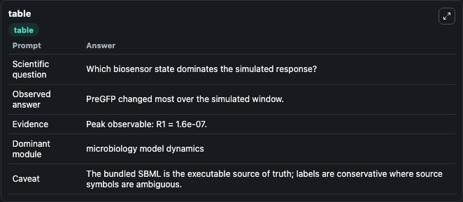
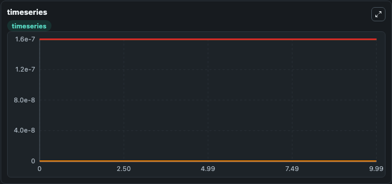
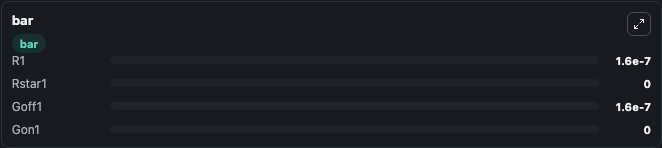

# Shaw2019 - Digital biosensor model from Yeast Lab

Curated microbiology lab for Shaw2019 - Digital biosensor model from Yeast. The bundled SBML is executed directly through Tellurium and visualised with conservative, source-traceable labels.

This lab asks: **Which biosensor state dominates the simulated response?**

## Model Context

The core model executes the bundled sbml source through Biosimulant and publishes traceable state, summary, and observable ports. The visualisation model turns those ports into dark-mode run cards for quick inspection of microbiology dynamics.

Scope: microbiology model dynamics.

Caveat: The bundled SBML is the executable source of truth; labels are conservative where source symbols are ambiguous.

## Run Context

- Duration: 10
- Communication step: 0.01
- Initial inputs: lab defaults

## Primary Inputs

- Ligand Level (L)

## Primary Outputs

- Model state (state)
- Simulation summary (summary)
- Observable labels (species_labels)
- R1 (R1)
- Rstar1 (Rstar1)
- Goff1 (Goff1)
- Gon1 (Gon1)

## Model Wiring

- `shaw2019_yeast_digital_biosensor` uses `models/core`
- `visualisation` uses `models/visualisation`

- `shaw2019_yeast_digital_biosensor.state` -> `visualisation.shaw2019_yeast_digital_biosensor_state`
- `shaw2019_yeast_digital_biosensor.summary` -> `visualisation.shaw2019_yeast_digital_biosensor_summary`
- `shaw2019_yeast_digital_biosensor.species_labels` -> `visualisation.shaw2019_yeast_digital_biosensor_species_labels`
- `shaw2019_yeast_digital_biosensor.receptor_state_1` -> `visualisation.shaw2019_yeast_digital_biosensor_receptor_state_1`
- `shaw2019_yeast_digital_biosensor.active_receptor_state_1` -> `visualisation.shaw2019_yeast_digital_biosensor_active_receptor_state_1`
- `shaw2019_yeast_digital_biosensor.inactive_gprotein_state_1` -> `visualisation.shaw2019_yeast_digital_biosensor_inactive_gprotein_state_1`
- `shaw2019_yeast_digital_biosensor.active_gprotein_state_1` -> `visualisation.shaw2019_yeast_digital_biosensor_active_gprotein_state_1`

<!-- BIOSIMULANT_VISUALS_START -->
### Output Visualizations

#### visualisation table

The summary table records the numeric run outputs used to answer the lab question: Which biosensor state dominates the simulated response?

#### visualisation timeseries

The time-series view follows R1, Rstar1, Goff1, Gon1 through the simulated run so the transient and final microbial dynamics are visible in one panel.

#### visualisation bar

The comparison view ranks the headline outputs from this run, making the dominant endpoint responses easy to scan.

<!-- BIOSIMULANT_VISUALS_END -->

## Source and Dependencies

- Core model: `models/core`
- Visualisation model: `models/visualisation`
- Upstream source: biomodels_ebi:MODEL1901300002
- Upstream URL: https://www.ebi.ac.uk/biomodels/MODEL1901300002
- License: CC0
- Runtime packages: tellurium==2.2.11.2

## Running in Biosimulant

Open this folder as a Biosimulant lab, then run the canvas. The screenshots above were captured from the served lab UI in dark mode using the automated README visualisation workflow.
