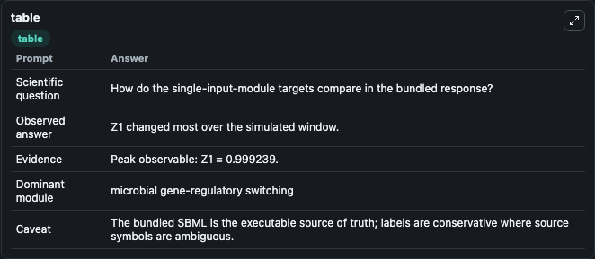
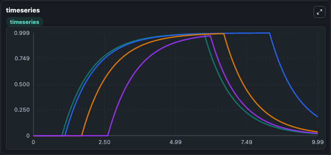
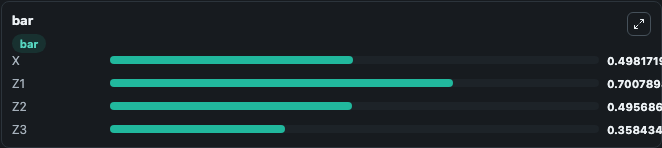

# Shen-Orr2002 Single Input Module Lab

Curated microbiology lab for Shen-Orr2002_Single_Input_Module. The bundled SBML is executed directly through Tellurium and visualised with conservative, source-traceable labels.

This lab asks: **How do the single-input-module targets compare in the bundled response?**

## Model Context

The core model executes the bundled sbml source through Biosimulant and publishes traceable state, summary, and observable ports. The visualisation model turns those ports into dark-mode run cards for quick inspection of microbiology dynamics.

Scope: microbial gene-regulatory switching.

Caveat: The bundled SBML is the executable source of truth; labels are conservative where source symbols are ambiguous.

## Run Context

- Duration: 10
- Communication step: 0.01
- Initial inputs: lab defaults

## Primary Inputs

- Input Regulator Level (X)

## Primary Outputs

- Model state (state)
- Simulation summary (summary)
- Observable labels (species_labels)
- X (X)
- Z1 (Z1)
- Z2 (Z2)
- Z3 (Z3)

## Model Wiring

- `shenorr2002_single_input_module` uses `models/core`
- `visualisation` uses `models/visualisation`

- `shenorr2002_single_input_module.state` -> `visualisation.shenorr2002_single_input_module_state`
- `shenorr2002_single_input_module.summary` -> `visualisation.shenorr2002_single_input_module_summary`
- `shenorr2002_single_input_module.species_labels` -> `visualisation.shenorr2002_single_input_module_species_labels`
- `shenorr2002_single_input_module.input_regulator` -> `visualisation.shenorr2002_single_input_module_input_regulator`
- `shenorr2002_single_input_module.target_gene_1` -> `visualisation.shenorr2002_single_input_module_target_gene_1`
- `shenorr2002_single_input_module.target_gene_2` -> `visualisation.shenorr2002_single_input_module_target_gene_2`
- `shenorr2002_single_input_module.target_gene_3` -> `visualisation.shenorr2002_single_input_module_target_gene_3`

<!-- BIOSIMULANT_VISUALS_START -->
### Output Visualizations

#### visualisation table

The summary table records the numeric run outputs used to answer the lab question: How do the single-input-module targets compare in the bundled response?

#### visualisation timeseries

The time-series view follows X, Z1, Z2, Z3 through the simulated run so the transient and final microbial dynamics are visible in one panel.

#### visualisation bar

The comparison view ranks the headline outputs from this run, making the dominant endpoint responses easy to scan.

<!-- BIOSIMULANT_VISUALS_END -->

## Source and Dependencies

- Core model: `models/core`
- Visualisation model: `models/visualisation`
- Upstream source: biomodels_ebi:BIOMD0000000317
- Upstream URL: https://www.ebi.ac.uk/biomodels/BIOMD0000000317
- License: CC0
- Runtime packages: tellurium==2.2.11.2

## Running in Biosimulant

Open this folder as a Biosimulant lab, then run the canvas. The screenshots above were captured from the served lab UI in dark mode using the automated README visualisation workflow.
