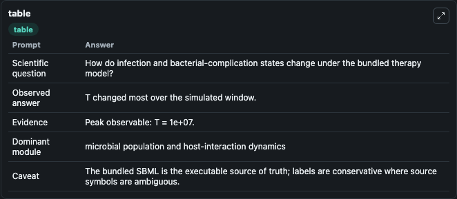
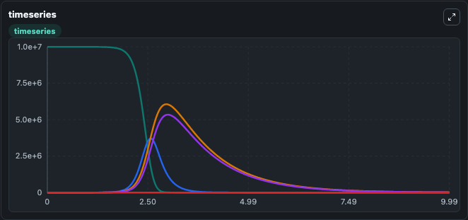
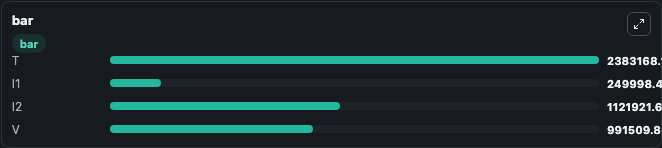

# Smith2016-Combination therapy to prevent bacterial coinfection during influenza. Lab

Curated microbiology lab for Smith2016-Combination therapy to prevent bacterial coinfection during influenza.. The bundled SBML is executed directly through Tellurium and visualised with conservative, source-traceable labels.

This lab asks: **How do infection and bacterial-complication states change under the bundled therapy model?**

## Model Context

The core model executes the bundled sbml source through Biosimulant and publishes traceable state, summary, and observable ports. The visualisation model turns those ports into dark-mode run cards for quick inspection of microbiology dynamics.

Scope: microbial population and host-interaction dynamics.

Caveat: The bundled SBML is the executable source of truth; labels are conservative where source symbols are ambiguous.

## Run Context

- Duration: 10
- Communication step: 0.01
- Initial inputs: lab defaults

## Primary Inputs

- Transmission Rate (beta)
- Initial Viral Load (V)
- Initial Target Cells (T)

## Primary Outputs

- Model state (state)
- Simulation summary (summary)
- Observable labels (species_labels)
- T (T)
- I1 (I1)
- I2 (I2)
- V (V)

## Model Wiring

- `smith2016_bacterial_coinfection_therapy` uses `models/core`
- `visualisation` uses `models/visualisation`

- `smith2016_bacterial_coinfection_therapy.state` -> `visualisation.smith2016_bacterial_coinfection_therapy_state`
- `smith2016_bacterial_coinfection_therapy.summary` -> `visualisation.smith2016_bacterial_coinfection_therapy_summary`
- `smith2016_bacterial_coinfection_therapy.species_labels` -> `visualisation.smith2016_bacterial_coinfection_therapy_species_labels`
- `smith2016_bacterial_coinfection_therapy.target_cells` -> `visualisation.smith2016_bacterial_coinfection_therapy_target_cells`
- `smith2016_bacterial_coinfection_therapy.infected_cells_type_1` -> `visualisation.smith2016_bacterial_coinfection_therapy_infected_cells_type_1`
- `smith2016_bacterial_coinfection_therapy.infected_cells_type_2` -> `visualisation.smith2016_bacterial_coinfection_therapy_infected_cells_type_2`
- `smith2016_bacterial_coinfection_therapy.viral_load` -> `visualisation.smith2016_bacterial_coinfection_therapy_viral_load`

<!-- BIOSIMULANT_VISUALS_START -->
### Output Visualizations

#### visualisation table

The summary table records the numeric run outputs used to answer the lab question: How do infection and bacterial-complication states change under the bundled therapy model?

#### visualisation timeseries

The time-series view follows T, I1, I2, V through the simulated run so the transient and final microbial dynamics are visible in one panel.

#### visualisation bar

The comparison view ranks the headline outputs from this run, making the dominant endpoint responses easy to scan.

<!-- BIOSIMULANT_VISUALS_END -->

## Source and Dependencies

- Core model: `models/core`
- Visualisation model: `models/visualisation`
- Upstream source: biomodels_ebi:MODEL1812040005
- Upstream URL: https://www.ebi.ac.uk/biomodels/MODEL1812040005
- License: CC0
- Runtime packages: tellurium==2.2.11.2

## Running in Biosimulant

Open this folder as a Biosimulant lab, then run the canvas. The screenshots above were captured from the served lab UI in dark mode using the automated README visualisation workflow.
