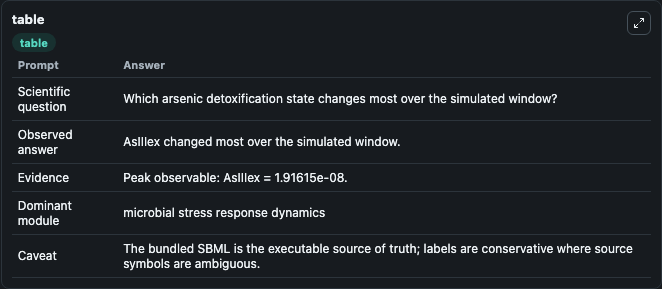
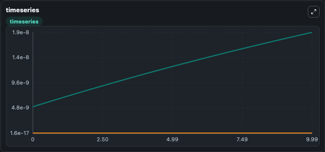
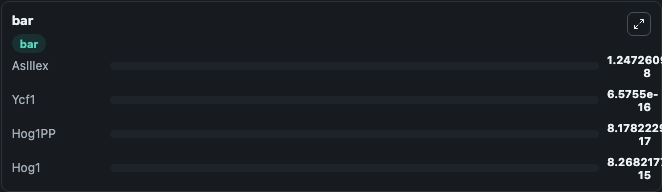

# Talemi2014 - Arsenic toxicity and detoxification mechanisms in yeast Lab

Curated microbiology lab for Talemi2014 - Arsenic toxicity and detoxification mechanisms in yeast. The bundled SBML is executed directly through Tellurium and visualised with conservative, source-traceable labels.

This lab asks: **Which arsenic detoxification state changes most over the simulated window?**

## Model Context

The core model executes the bundled sbml source through Biosimulant and publishes traceable state, summary, and observable ports. The visualisation model turns those ports into dark-mode run cards for quick inspection of microbiology dynamics.

Scope: microbial stress response dynamics.

Caveat: The bundled SBML is the executable source of truth; labels are conservative where source symbols are ambiguous.

## Run Context

- Duration: 10
- Communication step: 0.01
- Initial inputs: lab defaults

## Primary Inputs

- Arsenite Shock Level (parameter_6)
- Arsenite Shock Start Time (parameter_7)
- Extracellular Arsenite Initial (parameter_5)

## Primary Outputs

- Model state (state)
- Simulation summary (summary)
- Observable labels (species_labels)
- AsIIIex (species_6)
- Ycf1 (species_5)
- Hog1PP (species_10)
- Hog1 (species_9)

## Model Wiring

- `talemi2014_yeast_arsenic_detoxification` uses `models/core`
- `visualisation` uses `models/visualisation`

- `talemi2014_yeast_arsenic_detoxification.state` -> `visualisation.talemi2014_yeast_arsenic_detoxification_state`
- `talemi2014_yeast_arsenic_detoxification.summary` -> `visualisation.talemi2014_yeast_arsenic_detoxification_summary`
- `talemi2014_yeast_arsenic_detoxification.species_labels` -> `visualisation.talemi2014_yeast_arsenic_detoxification_species_labels`
- `talemi2014_yeast_arsenic_detoxification.extracellular_arsenite` -> `visualisation.talemi2014_yeast_arsenic_detoxification_extracellular_arsenite`
- `talemi2014_yeast_arsenic_detoxification.ycf1_transporter` -> `visualisation.talemi2014_yeast_arsenic_detoxification_ycf1_transporter`
- `talemi2014_yeast_arsenic_detoxification.phosphorylated_hog1` -> `visualisation.talemi2014_yeast_arsenic_detoxification_phosphorylated_hog1`
- `talemi2014_yeast_arsenic_detoxification.hog1_mapk` -> `visualisation.talemi2014_yeast_arsenic_detoxification_hog1_mapk`

<!-- BIOSIMULANT_VISUALS_START -->
### Output Visualizations

#### visualisation table

The summary table records the numeric run outputs used to answer the lab question: Which arsenic detoxification state changes most over the simulated window?

#### visualisation timeseries

The time-series view follows AsIIIex, Ycf1, Hog1PP, Hog1 through the simulated run so the transient and final microbial dynamics are visible in one panel.

#### visualisation bar

The comparison view ranks the headline outputs from this run, making the dominant endpoint responses easy to scan.

<!-- BIOSIMULANT_VISUALS_END -->

## Source and Dependencies

- Core model: `models/core`
- Visualisation model: `models/visualisation`
- Upstream source: biomodels_ebi:BIOMD0000000547
- Upstream URL: https://www.ebi.ac.uk/biomodels/BIOMD0000000547
- License: CC0
- Runtime packages: tellurium==2.2.11.2

## Running in Biosimulant

Open this folder as a Biosimulant lab, then run the canvas. The screenshots above were captured from the served lab UI in dark mode using the automated README visualisation workflow.
