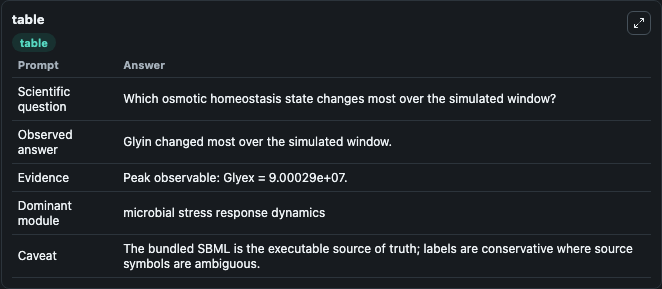
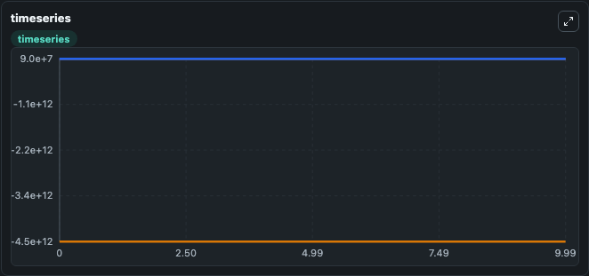
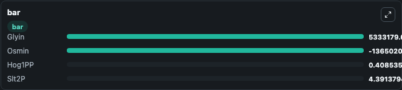

# Talemi2016 - Yeast osmo-homoestasis Lab

Curated microbiology lab for Talemi2016 - Yeast osmo-homoestasis. The bundled SBML is executed directly through Tellurium and visualised with conservative, source-traceable labels.

This lab asks: **Which osmotic homeostasis state changes most over the simulated window?**

## Model Context

The core model executes the bundled sbml source through Biosimulant and publishes traceable state, summary, and observable ports. The visualisation model turns those ports into dark-mode run cards for quick inspection of microbiology dynamics.

Scope: microbial stress response dynamics.

Caveat: The bundled SBML is the executable source of truth; labels are conservative where source symbols are ambiguous.

## Run Context

- Duration: 10
- Communication step: 0.01
- Initial inputs: lab defaults

## Primary Inputs

- External Osmolarity (Osmex)
- Hog Pathway Signal (HOGSignal)

## Primary Outputs

- Model state (state)
- Simulation summary (summary)
- Observable labels (species_labels)
- Glyin (Glyin)
- Osmin (Osmin)
- Hog1PP (Hog1PP)
- Slt2P (Slt2P)

## Model Wiring

- `talemi2016_yeast_osmohomeostasis` uses `models/core`
- `visualisation` uses `models/visualisation`

- `talemi2016_yeast_osmohomeostasis.state` -> `visualisation.talemi2016_yeast_osmohomeostasis_state`
- `talemi2016_yeast_osmohomeostasis.summary` -> `visualisation.talemi2016_yeast_osmohomeostasis_summary`
- `talemi2016_yeast_osmohomeostasis.species_labels` -> `visualisation.talemi2016_yeast_osmohomeostasis_species_labels`
- `talemi2016_yeast_osmohomeostasis.intracellular_glycerol` -> `visualisation.talemi2016_yeast_osmohomeostasis_intracellular_glycerol`
- `talemi2016_yeast_osmohomeostasis.osmotic_signal` -> `visualisation.talemi2016_yeast_osmohomeostasis_osmotic_signal`
- `talemi2016_yeast_osmohomeostasis.phosphorylated_hog1_mapk` -> `visualisation.talemi2016_yeast_osmohomeostasis_phosphorylated_hog1_mapk`
- `talemi2016_yeast_osmohomeostasis.phosphorylated_slt2_mapk` -> `visualisation.talemi2016_yeast_osmohomeostasis_phosphorylated_slt2_mapk`

<!-- BIOSIMULANT_VISUALS_START -->
### Output Visualizations

#### visualisation table

The summary table records the numeric run outputs used to answer the lab question: Which osmotic homeostasis state changes most over the simulated window?

#### visualisation timeseries

The time-series view follows Glyin, Osmin, Hog1PP, Slt2P through the simulated run so the transient and final microbial dynamics are visible in one panel.

#### visualisation bar

The comparison view ranks the headline outputs from this run, making the dominant endpoint responses easy to scan.

<!-- BIOSIMULANT_VISUALS_END -->

## Source and Dependencies

- Core model: `models/core`
- Visualisation model: `models/visualisation`
- Upstream source: biomodels_ebi:MODEL1606100000
- Upstream URL: https://www.ebi.ac.uk/biomodels/MODEL1606100000
- License: CC0
- Runtime packages: tellurium==2.2.11.2

## Running in Biosimulant

Open this folder as a Biosimulant lab, then run the canvas. The screenshots above were captured from the served lab UI in dark mode using the automated README visualisation workflow.
