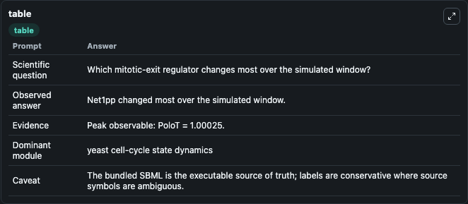
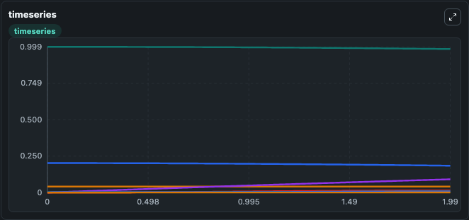
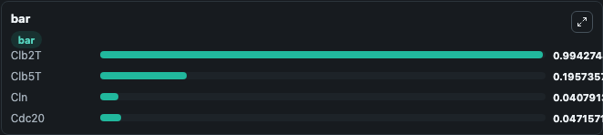

# Vinod2011 MitoticExit Lab

Curated microbiology lab for Vinod2011_MitoticExit. The bundled SBML is executed directly through Tellurium and visualised with conservative, source-traceable labels.

This lab asks: **Which mitotic-exit regulator changes most over the simulated window?**

## Model Context

The core model executes the bundled sbml source through Biosimulant and publishes traceable state, summary, and observable ports. The visualisation model turns those ports into dark-mode run cards for quick inspection of microbiology dynamics.

Scope: yeast cell-cycle state dynamics.

Caveat: The bundled SBML is the executable source of truth; labels are conservative where source symbols are ambiguous.

## Run Context

- Duration: 2
- Communication step: 0.01
- Initial inputs: lab defaults

## Primary Inputs

- Initial Total Clb2 Cyclin (Clb2T_1)
- Initial Total Clb5 Cyclin (Clb5T_1)

## Primary Outputs

- Model state (state)
- Simulation summary (summary)
- Observable labels (species_labels)
- Clb2T (Clb2T_1)
- Clb5T (Clb5T_1)
- Cln (Cln_1)
- Cdc20 (Cdc20_1)

## Model Wiring

- `vinod2011_budding_yeast_mitotic_exit` uses `models/core`
- `visualisation` uses `models/visualisation`

- `vinod2011_budding_yeast_mitotic_exit.state` -> `visualisation.vinod2011_budding_yeast_mitotic_exit_state`
- `vinod2011_budding_yeast_mitotic_exit.summary` -> `visualisation.vinod2011_budding_yeast_mitotic_exit_summary`
- `vinod2011_budding_yeast_mitotic_exit.species_labels` -> `visualisation.vinod2011_budding_yeast_mitotic_exit_species_labels`
- `vinod2011_budding_yeast_mitotic_exit.total_clb2_cyclin` -> `visualisation.vinod2011_budding_yeast_mitotic_exit_total_clb2_cyclin`
- `vinod2011_budding_yeast_mitotic_exit.total_clb5_cyclin` -> `visualisation.vinod2011_budding_yeast_mitotic_exit_total_clb5_cyclin`
- `vinod2011_budding_yeast_mitotic_exit.cln_cyclin` -> `visualisation.vinod2011_budding_yeast_mitotic_exit_cln_cyclin`
- `vinod2011_budding_yeast_mitotic_exit.cdc20_activator` -> `visualisation.vinod2011_budding_yeast_mitotic_exit_cdc20_activator`

<!-- BIOSIMULANT_VISUALS_START -->
### Output Visualizations

#### visualisation table

The summary table records the numeric run outputs used to answer the lab question: Which mitotic-exit regulator changes most over the simulated window?

#### visualisation timeseries

The time-series view follows Clb2T, Clb5T, Cln, Cdc20 through the simulated run so the transient and final microbial dynamics are visible in one panel.

#### visualisation bar

The comparison view ranks the headline outputs from this run, making the dominant endpoint responses easy to scan.

<!-- BIOSIMULANT_VISUALS_END -->

## Source and Dependencies

- Core model: `models/core`
- Visualisation model: `models/visualisation`
- Upstream source: biomodels_ebi:BIOMD0000000370
- Upstream URL: https://www.ebi.ac.uk/biomodels/BIOMD0000000370
- License: CC0
- Runtime packages: tellurium==2.2.11.2

## Running in Biosimulant

Open this folder as a Biosimulant lab, then run the canvas. The screenshots above were captured from the served lab UI in dark mode using the automated README visualisation workflow.
