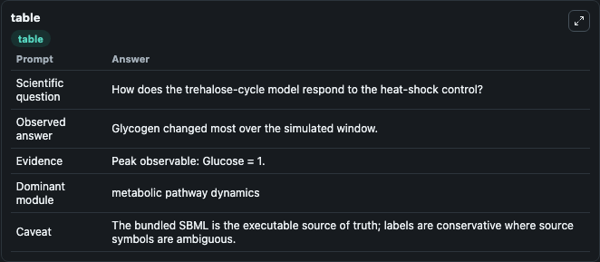
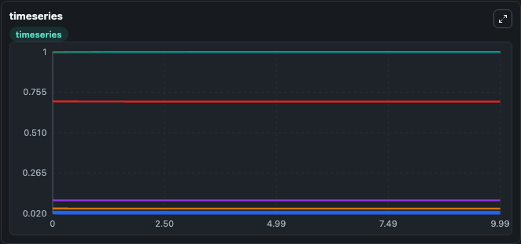
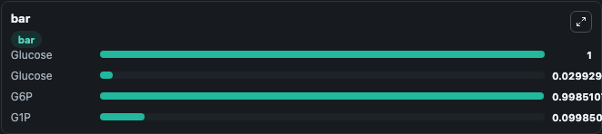

# Voit2003 - Trehalose Cycle Lab

Curated microbiology lab for Voit2003 - Trehalose Cycle. The bundled SBML is executed directly through Tellurium and visualised with conservative, source-traceable labels.

This lab asks: **How does the trehalose-cycle model respond to the heat-shock control?**

## Model Context

The core model executes the bundled sbml source through Biosimulant and publishes traceable state, summary, and observable ports. The visualisation model turns those ports into dark-mode run cards for quick inspection of microbiology dynamics.

Scope: metabolic pathway dynamics.

Caveat: The bundled SBML is the executable source of truth; labels are conservative where source symbols are ambiguous.

## Run Context

- Duration: 10
- Communication step: 0.01
- Initial inputs: lab defaults

## Primary Inputs

- Heat Shock (heat_shock)

## Primary Outputs

- Model state (state)
- Simulation summary (summary)
- Observable labels (species_labels)
- Glucose (X0)
- Glucose (X1)
- G6P (X2)
- G1P (X3)

## Model Wiring

- `voit2003_yeast_trehalose_cycle` uses `models/core`
- `visualisation` uses `models/visualisation`

- `voit2003_yeast_trehalose_cycle.state` -> `visualisation.voit2003_yeast_trehalose_cycle_state`
- `voit2003_yeast_trehalose_cycle.summary` -> `visualisation.voit2003_yeast_trehalose_cycle_summary`
- `voit2003_yeast_trehalose_cycle.species_labels` -> `visualisation.voit2003_yeast_trehalose_cycle_species_labels`
- `voit2003_yeast_trehalose_cycle.glucose` -> `visualisation.voit2003_yeast_trehalose_cycle_glucose`
- `voit2003_yeast_trehalose_cycle.glucose_pool_2` -> `visualisation.voit2003_yeast_trehalose_cycle_glucose_pool_2`
- `voit2003_yeast_trehalose_cycle.glucose_6_phosphate` -> `visualisation.voit2003_yeast_trehalose_cycle_glucose_6_phosphate`
- `voit2003_yeast_trehalose_cycle.glucose_1_phosphate` -> `visualisation.voit2003_yeast_trehalose_cycle_glucose_1_phosphate`

<!-- BIOSIMULANT_VISUALS_START -->
### Output Visualizations

#### visualisation table

The summary table records the numeric run outputs used to answer the lab question: How does the trehalose-cycle model respond to the heat-shock control?

#### visualisation timeseries

The time-series view follows Glucose, Glucose, G6P, G1P through the simulated run so the transient and final microbial dynamics are visible in one panel.

#### visualisation bar

The comparison view ranks the headline outputs from this run, making the dominant endpoint responses easy to scan.

<!-- BIOSIMULANT_VISUALS_END -->

## Source and Dependencies

- Core model: `models/core`
- Visualisation model: `models/visualisation`
- Upstream source: biomodels_ebi:BIOMD0000000266
- Upstream URL: https://www.ebi.ac.uk/biomodels/BIOMD0000000266
- License: CC0
- Runtime packages: tellurium==2.2.11.2

## Running in Biosimulant

Open this folder as a Biosimulant lab, then run the canvas. The screenshots above were captured from the served lab UI in dark mode using the automated README visualisation workflow.
